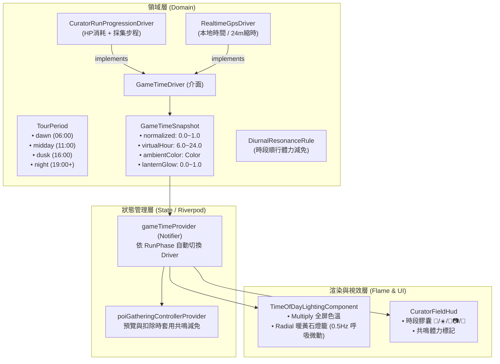

# Share Tour: 日夜時間系統升級執行計劃 (Executable Plan: Day/Night Diurnal Cycle System)

本文件依據遊戲企劃、系統架構工程師與技術負責人之三方研討共識制定，旨在將現行離散 4 幕光照雛形升級為具備**連續平滑色溫過渡**、**真實與進程雙軌驅動**、以及**時段順行採集體力共鳴**之完整系統。

---

## 1. 系統目標與不可侵犯約束 (Vision & Inviolate Constraints)

### 1.1 核心升級目標
1. **連續平滑色溫過渡（Continuous Lerp Engine）**：消除 HP 階梯跳變導致的畫面突閃，改以純量進度進行高質感環境光影過渡。
2. **時鐘驅動雙軌制（Dual-Track Time Driver）**：
   - **踩線局內（Curator Run）**：由策展進程（體力消耗與採集次數）驅動，完整呈現 06:00 至 24:00 的一日四幕旅程。
   - **大世界漫遊（Free Roam）**：支援手機真實 GPS 本地時間或 24 分鐘展示縮時循環，杜絕生活作息限制導向的死局。
3. **時段順行採集紅利（Diurnal Stamina Resonance）**：在對應時段採集契合標籤素材獲得體力減免，加深路線規劃策略。

### 1.2 不可侵犯架構約束（Three Red Lines）
1. 🔴 **嚴禁破壞 Amendment-01 平衡包**：
   - `TravelMaterial`（素材固有 Hype/Theme/Cost/Risk/isSpotlight）與 `ClientReviewEngine` 結算算法**保持 100% 凍結**。
   - 時段玩法影響**僅限於採集階段的體力消耗折讓（HP Debit Modifier）**，絕不污染素材自身屬性與終局評分。
2. 🔴 **嚴禁破壞 GPS 凍結管線（Phase C Assets）**：
   - 台灣地圖、`map_manifest.dart`、GPS 座標過濾與平滑管線保持零 diff。
3. 🔴 **Flame 60fps 低溫零記憶體配置保證**：
   - 嚴禁在 `render()` 迴圈中宣告任何新物件（`Paint`, `Color`, `Gradient`），所有色彩與光暈半徑採靜態快取與純量調變。

---

## 2. 系統架構與模組劃分 (System Architecture)



---

## 3. 領域數值與數學公式定義 (Mathematical Formulations)

### 3.1 策展局內時間推移公式（CuratorRunProgressionDriver）
單局踩線的虛擬時間進程 $t \in [0.0, 1.0]$ 由阿導「體力消耗比例」與「腰包採集進度」共同平滑加權：

$$t = 0.70 \times \left(1.0 - \frac{\text{currentHp}}{\text{maxHp}}\right) + 0.30 \times \left(\frac{\text{gatheredCount}}{\text{waistBagCapacity}}\right)$$

- 若處於 `nightEditing`、`clientReview` 或 `settled` 階段，$t \equiv 1.0$（深夜 24:00）。
- 虛擬時間換算：
  $$\text{virtualHour} = 6.0 + 18.0 \times t \quad (\text{範圍 } 06:00 \sim 24:00)$$

### 3.2 色溫插值矩陣（Continuous Ambient Lerp LUT）
定義 5 個關鍵錨點，兩點之間採三次平滑或線性插值：

| 錨點進度 $t$ | 虛擬時刻 | 錨點色碼 (ARGB) | 視覺特徵 | 燈籠輝光權重 |
|---|---|---|---|---|
| $t = 0.00$ | 06:00 (晨曦) | `0x30A5C9E8` | 冷青薄霧、晨光晨曦 | 0.00 |
| $t = 0.30$ | 11:24 (午後) | `0x05FFFDE8` | 透亮暖白、高能見度 | 0.00 |
| $t = 0.60$ | 16:48 (黃昏) | `0x55F59E0B` | 琥珀金橙、相機 1.5x | 0.40 |
| $t = 0.75$ | 19:30 (薄暮) | `0x659333EA` | 逢魔之刻、紫金沉暮 | 0.85 |
| $t = 1.00$ | 24:00 (暗夜) | `0x800B132B` | 黛藍深邃、街町燈火 | 1.00 |

### 3.3 時段順行體力紅利（Diurnal Resonance Rule）
景點標籤與時段對應關係：
- **晨曦 (06:00~10:00)**：`#散步`, `#早市`, `#寺院`, `#自然`
- **午後 (10:00~15:30)**：`#名店`, `#大眾名店`, `#咖啡`, `#文化`, `#街區`
- **黃昏 (15:30~18:30)**：`#絕景`, `#展望`, `#古道`, `#夕照`
- **深夜 (18:30~24:00)**：`#深夜`, `#居酒屋`, `#夜櫻`, `#酒吧`, `#小酌`

**體力折讓公式**：
$$\text{finalHpCost} = \max\left(1, \text{baseHpCost} - \text{resonanceDiscount}\right)$$
- 當素材具備至少一個當前時段契合標籤時，$\text{resonanceDiscount} = 3$ 點 HP；否則為 0。
- 體力保底：單次採集最少仍須扣除 1 HP，杜絕無限免費採集。

---

## 4. 任務拆解與原子提交序列 (Atomic Tasks & Commit Plan)

### Task 1: Domain 時間模型與雙軌時鐘驅動器
- **Files**:
  - Create: `lib/domain/core_loop/time/tour_period.dart`
  - Create: `lib/domain/core_loop/time/game_time_snapshot.dart`
  - Create: `lib/domain/core_loop/time/game_time_driver.dart`
  - Create: `lib/domain/core_loop/time/curator_run_progression_driver.dart`
  - Create: `lib/domain/core_loop/time/realtime_gps_driver.dart`
  - Test: `test/domain/core_loop/time/game_time_driver_test.dart`
- **AC Checklist**:
  - `t=0.0` 正確映射至 06:00 晨曦；`t=1.0` 映射至 24:00 深夜。
  - HP 扣減與背包增加時，進度數值嚴格單調遞增，無突波逆流。
  - `RealtimeGpsDriver` 依輸入 DateTime 正確推導虛擬時間。
- **Commit**: `feat(time): add dual-track diurnal time drivers and domain snapshots`

### Task 2: 時段順行體力共鳴規則 (Diurnal Resonance Rule)
- **Files**:
  - Create: `lib/domain/core_loop/time/diurnal_resonance_rule.dart`
  - Test: `test/domain/core_loop/time/diurnal_resonance_rule_test.dart`
- **AC Checklist**:
  - 契合標籤折讓恰為 3 HP；非契合為 0；最終扣款不低於 1 HP。
  - 嚴格隔離：不修改素材的 `TravelMaterial` 實體，不改動 Hype/Theme/Cost。
- **Commit**: `feat(time): implement diurnal stamina resonance gathering discounts`

### Task 3: Flame 連續平滑漸變光照與呼吸燈火升級
- **Files**:
  - Modify: `lib/game/components/time_of_day_lighting_component.dart`
  - Test: `test/game/components/time_of_day_lighting_component_test.dart`
- **AC Checklist**:
  - 兩相鄰時間點之間色溫平滑 Lerp，無任何 1 幀色偏突變。
  - 暖黃石燈籠與玩家提燈在 $t \ge 0.60$ 時依呼吸頻率 $0.5\text{Hz}$ 微動。
  - 在 `render()` 週期中 0 bytes 堆疊記憶體配置。
- **Commit**: `feat(lighting): upgrade lighting component with continuous lerp and lantern breathing`

### Task 4: State 與 UI 完整接線 (Riverpod & HUD)
- **Files**:
  - Create: `lib/state/core_loop/game_time_controller.dart`
  - Modify: `lib/state/core_loop/poi_gathering_controller.dart`
  - Modify: `lib/ui/core_loop/field/curator_field_hud.dart`
  - Modify: `lib/ui/core_loop/field/attraction_detail_card.dart`
  - Test: `test/ui/core_loop/field/curator_field_hud_test.dart`
  - Test: `test/state/core_loop/poi_gathering_controller_test.dart`
- **AC Checklist**:
  - HUD 時段膠囊動態顯示指針與虛擬時間，黃昏時亮起 📷 標記。
  - 取材預覽卡片若享有時段共鳴，明確標註綠色折讓文案。
- **Commit**: `feat(ui): connect diurnal time state with HUD and gathering preview`

### Task 5: 驗證矩陣與全套回歸驗收
- **Command Sequence**:
  ```bash
  dart run build_runner build --delete-conflicting-outputs
  dart run tool/search_mvp_balance.dart
  flutter analyze
  flutter test
  git diff "$(cat /tmp/share-tour-a1-base-sha)" -- lib/domain/location/projection/map_manifest.dart lib/game/map_module/manifests/taiwan_map_manifest.dart lib/domain/location/pipeline lib/data/location
  ```
- **Commit**: `docs(time): verify diurnal cycle system acceptance and zero-regression`

---

## 5. 實施階段審查機制 (Sign-off Protocol)

每次任務交付必須確保：
1. `flutter analyze` 保持 0 issues。
2. 全套單元與整合測試 0 failures。
3. 凍結資產 0 diff。
