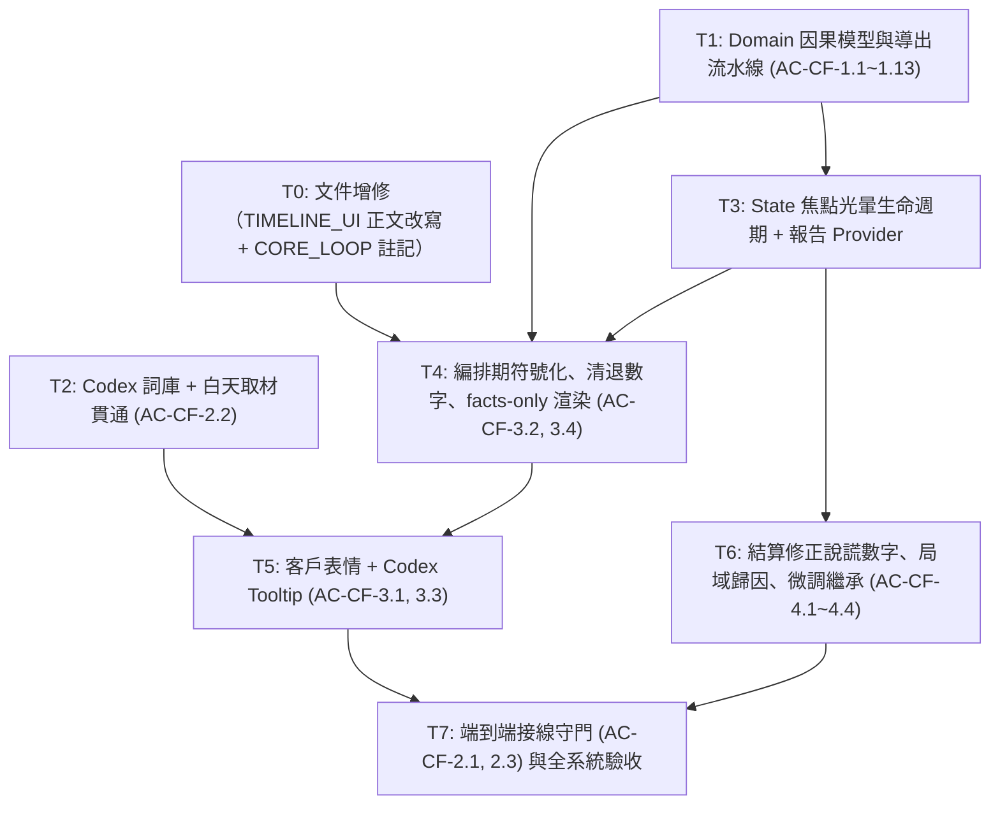

# PLAN — MVP 玩法因果可視化實作計劃

狀態：**已簽核（v5，2026-09-12 由使用者明確簽核）**
流程位置：`spec (已簽核) → plan (已簽核) → 執行計劃 (已簽核) → 待 G4 清償後實作`
上位規格：`SPEC_MVP_CAUSAL_FEEDBACK.md` (v5)、`SPEC_MVP_CORE_LOOP.md`、`SPEC_MVP_TIMELINE_UI.md`
架構約束：`CLAUDE.md`、`CROSS_CUTTING_CONSTRAINTS.md`

> **v5 修訂摘要（相對 v4，第二輪雙軌覆核修訂）**
> 1. **`facts` 排序鍵納入相鄰對**（覆核 P0-3）：排序鍵修正為 `domain → (slotIndex ?? pairIndices?.$1 ?? 99) → (pairIndices?.$2 ?? 99) → reasonCode`，確保多組相鄰槽位事實具備全序決定性。
> 2. **T4 硬約束釐清邊界**（覆核 P0-4）：明定因果符號（徽章、光軌、警告）一律只從 facts 渲染；牌面屬性、成本、預算、相機倍率與看板基礎計數（如 `stats.spotlightCount`）除外。
> 3. **`itineraryCausalReportProvider` 細粒度 `.select` 訂閱**（覆核 P1-1）：改以 `.select` 訂閱 run state 的 itinerary/philosophy/client，避免阿導走路扣 HP 或取材時擊穿 Memoization 引起無效重算。
> 4. **T1 集合欄位手寫深層比對**（覆核 P1-3）：規範 `ItineraryStats.operator ==` 補齊的五個集合欄位必須在純 Dart 下手寫深層內容比對，避免 identity 比對導致 memoization 破功。
> 5. **六態表情統整**（覆核 P1-6）：修正多處「五態」字面殘留，全面對齊六態（含 `idle`）。

---

## 1. 架構分層與檔案結構

```text
lib/
├── domain/core_loop/
│   ├── causal/
│   │   ├── causal_fact.dart              # [T1] 純 Dart 因果事實、強度、六態心態與報告模型
│   │   ├── causal_report_builder.dart    # [T1] 由 stats/philosophy/client 導出報告的純函式
│   │   └── curator_codex.dart            # [T2] 世界觀行話詞庫（純文字、零具名城市）
│   ├── models/
│   │   └── travel_material.dart          # [T1] 新增 getter: bool get hasFatigueRisk => riskLevel >= 3;
│   └── run/
│       └── curator_run_state.dart        # [T3] 僅新增 focusedCulpritSlot + clearFocusedCulpritSlot
├── state/core_loop/
│   ├── curator_run_providers.dart        # [T3] itineraryCausalReportProvider（導出式 Provider）
│   └── curator_run_controller.dart       # [T3] tweakItinerary(culpritSlot) 與消褪政策
└── ui/core_loop/
    ├── curator_studio_modal.dart         # [T5] 裝配客戶表情列
    ├── review_settlement_modal.dart      # [T6] 局域歸因、策略提示、傳遞元兇槽位
    ├── components/
    │   ├── client_expression_tile.dart   # [T5] 單一客戶六態表情（Key('client_expression')）
    │   ├── causal_badge.dart             # [T4] 因果徽章（可點擊，承載 reasonCode）
    │   ├── codex_tooltip.dart            # [T5] Tap-to-Inspect 詞條氣泡
    │   ├── timeline_rail.dart            # [T4] 相鄰軸四態同軌同階：疲勞／節奏／連段
    │   ├── compact_slot_card.dart        # [T4] 槽位徽章、時段契合微光、元兇光暈
    │   └── live_preview_hud.dart         # [T4] 清退計分數字，保留成本與預算警示
    └── field/
        ├── attraction_detail_card.dart   # [T2] 白天卡面 [💀 拉車隱患]
        └── gathering_replace_bottom_sheet.dart # [T2] 同上

test/
├── domain/core_loop/causal_feedback_test.dart              # [T1] AC-CF-1.1~1.9
├── data/... （無新增；Codex 測試置於 domain）
├── domain/core_loop/curator_codex_test.dart                # [T2] AC-CF-2.2
├── state/core_loop/curator_run_causal_test.dart            # [T3] 光暈注入與消褪
├── ui/core_loop/causal_studio_ui_test.dart                 # [T4/T5] AC-CF-3.1~3.3
├── ui/core_loop/review_attribution_widget_test.dart        # [T6] AC-CF-4.1~4.3
└── ui/core_loop/causal_wiring_test.dart                    # [T7] AC-CF-2.1 / 2.3（端到端，不放 architecture/）
```

---

## 2. 抽象邊界與防線

依 `CLAUDE.md` §3「抽象只在擋住已知會變的軸時才做」：

1. **零新抽象**。`CausalFact`／`ItineraryCausalReport` 是不可變純資料；`CuratorCodex` 是靜態 `Map`；`CausalReportBuilder` 是純函式集合。不引入介面、不引入套件（CLAUDE.md §6）。
2. **單一真相源**。因果報告是 `ItineraryStats` + `TravelPhilosophy` + `ClientSpec` 的**純導出值**，因此：
   - **不**存入 `CuratorRunState`（存了就有兩份、就會不同步）。
   - 只在 `state/` 以 Provider 派生，UI 以 `.select` 訂閱所需切片。
   - **複用既有的 `itineraryStatsProvider`**（`curator_run_providers.dart:54-57`，註解明載「具備 Riverpod Memoization，供 HUD 與光軌共享」），**不得**呼叫 `state.currentStats` —— 那是 getter，每次呼叫重跑一次 `calculateStats`，會讓 HUD／光軌與因果報告拿到兩個不同實例。
   - 唯一例外是 `primaryCulpritSlot` 的**焦點狀態**：它是「玩家從結算帶回來的一次性 UI 意圖」，不是導出值，故存於 `CuratorRunState`。報告中的 `primaryCulpritSlot` 是計算結果，狀態中的是繼承下來的焦點，兩者命名相同但語意不同 —— 狀態欄位命名為 `focusedCulpritSlot` 以免混淆。
3. **值相等性（rebuild 抑制的前提）**。`CausalFact` 與 `ItineraryCausalReport` 覆寫 `operator ==` / `hashCode`。`facts` 是 `List`：
   ```dart
   // domain/ 不得 import package:flutter，listEquals 不可用，手寫：
   static bool _factsEqual(List<CausalFact> a, List<CausalFact> b) {
     if (identical(a, b)) return true;
     if (a.length != b.length) return false;
     for (var i = 0; i < a.length; i++) {
       if (a[i] != b[i]) return false;
     }
     return true;
   }
   // hashCode: Object.hash(Object.hashAll(facts), clientImpression, ...)
   ```
   **手寫 `==` 的價值在哪、不在哪**（v3 論述有誤，此處更正）：`.select` 比較的是**選出的切片**（如 `ClientImpression` 這個 enum），即使不手寫 `==`，`.select` 訂閱者一樣會被抑制。手寫 `==` 真正保障的是 `AC-CF-1.9` 本身，以及**整份 report 訂閱者**在 Provider 層的傳播抑制。不要把兩者說成同一件事，否則實作者會誤判因果。
4. **分層純度**：
   - `domain/core_loop/causal/` 零 Flutter / Flame / `dart:ui`。
   - Codex 詞條文字零具名城市（沿用 `layer_boundaries_test.dart` 第 2 條規則涵蓋 `lib/domain`）。
   - UI 不得裸寫魔術數字：`riskLevel >= 3` 一律走 `material.hasFatigueRisk`；階梯判定一律讀 `CausalFact.intensity`。
5. **不改動計分規則**。本計劃只讀 `calculateStats` 與 `ClientReviewEngine` 的結果，不修改其中任何係數。唯一例外是 T6 的結算面板：那裡改的是**顯示用的分母與文案**，不動引擎。
6. **CC-3 邊界**。事件日誌目前只有 `profileCreated` / `philosophyRerolled` / `equipmentUpgraded` / `runSettled` 四型，全為局外進度。`focusedCulpritSlot` 是 UI 焦點，**禁止寫入事件日誌**，不影響重播決定性。

---

## 3. 任務拆解與相依拓撲



T1 與 T2 可並行（T2 只需要 `hasFatigueRisk` 這個 getter，可由 T2 自行補上，不必等整條流水線）。

### 3.1 任務清單

| 任務 | 內容 | 產出 | 對應 AC |
|---|---|---|---|
| **T0** | **前置文件增修（不改程式碼）**。<br>‧ `SPEC_MVP_TIMELINE_UI.md`：作廢 `AC-UI-2.2`、改寫 §2.2C（HUD 只留 Cost 與預算警示、刪客群切換器）、§2.2B 卡面 `🎯` 改定性階梯；明載 `AC-UI-2.3`／`AC-UI-2.4`／§2.3 結算頁客群頁籤維持有效。<br>‧ **直接改寫同檔 §2.3 正文的過期數字**（不可只加附錄，否則同一文件兩套數字並存）。<br>‧ 一併處理 `AC-UI-1.4`／`AC-UI-2.5`（四槽才可提交，已被 `AC-A1-3.7/3.8` 取代）與 §1.2 的 `16ms / 120Hz` 宣稱。<br>‧ 指定 `AC-UI-3.2`／`AC-UI-3.3` 的承接者（SPEC §6.3）。<br>‧ `SPEC_MVP_CORE_LOOP.md`：補 `ClientSpec.personaName` 增修註記。 | `SPEC_MVP_TIMELINE_UI.md`<br>`SPEC_MVP_CORE_LOOP.md` | SPEC §6 |
| **T1** | **Domain 因果模型與導出流水線**。建 `causal_fact.dart`（含手寫值相等）與 `causal_report_builder.dart`：<br>‧ **14 條** reasonCode 的導出，逐條對齊 SPEC §2.2 表格的既有計算。<br>‧ 疲勞 Theme 側／Hype 側分離；Hype 側僅在 `client.type == hypeInfluencer` 時存在。<br>‧ 新增 `rhythm_complement`（與疲勞同軸正面）、`spotlight_shortfall`／`spotlight_full`（網紅限定）、`boredom_risk`（社畜限定）。<br>‧ `philosophy_repelled` 與 `philosophy_matched_*` 互斥（`travel_philosophy.dart:58` 短路）。<br>‧ `clientImpression` 由 `ReviewOutcome` 導出，`canSubmit == false` → `idle`（第六態）。<br>‧ `primaryCulpritSlot` 依 SPEC §2.4 五款優先序（含純絕景邊界防護與多疲勞對指涉），平手一律取索引較小者。<br>‧ **`facts` 明訂排序鍵**：`domain → (slotIndex ?? pairIndices?.$1 ?? 99) → (pairIndices?.$2 ?? 99) → reasonCode`，保證相鄰槽位對與單槽位事實皆具備嚴格全序決定性。<br>‧ `TravelMaterial` 補 `bool get hasFatigueRisk => riskLevel >= 3;`（類別內 getter）。<br>‧ 順手補齊 `ItineraryStats.operator ==` 漏掉的五個擊穿欄位，Set/List/Map 集合欄位**必須手寫純 Dart 深度比對**（SPEC §8.3）。 | `domain/core_loop/causal/*`<br>`domain/core_loop/models/travel_material.dart`<br>`domain/core_loop/models/timeline_itinerary.dart`<br>`test/domain/core_loop/causal_feedback_test.dart` | AC-CF-1.1~1.13 |
| **T2** | **命名：Codex 詞庫、客戶具名與白天語意貫通**。<br>‧ `curator_codex.dart` **14** 條詞條。<br>‧ `ClientSpec` 新增 `final String personaName`（`小林` / `安娜`）。<br>‧ 兩支 field UI 於 `hasFatigueRisk` 時標 `[💀 拉車隱患]`。<br>‧ `curator_briefing_modal.dart:258` 委託客戶改具名稱呼。 | `domain/core_loop/causal/curator_codex.dart`<br>`domain/core_loop/review/client_spec.dart`<br>`ui/core_loop/field/*`<br>`ui/core_loop/curator_briefing_modal.dart`<br>`test/domain/core_loop/curator_codex_test.dart` | AC-CF-2.2, 2.4 |
| **T3** | **State 焦點光暈生命週期**。<br>‧ `CuratorRunState` 新增 `final int? focusedCulpritSlot`，`copyWith` 同步新增 `bool clearFocusedCulpritSlot = false`，並納入 `operator ==` / `hashCode`。主建構子是單一入口，三個工廠（`:41,:82,:118`）給預設 `null` 即可，不必逐一改。<br>‧ `tweakItinerary({int? culpritSlot})`：**`culpritSlot` 為 null 時必須傳 `clearFocusedCulpritSlot: true`**，否則上一輪的舊焦點會被保留。<br>‧ 消褪政策：`placeMaterialInSlot` / `removeMaterialFromSlot` / `swapSlots` 內清除焦點。<br>‧ `itineraryCausalReportProvider`：改用 `curatorRunControllerProvider.select(...)` 細粒度訂閱 itinerary, philosophy, client，加上 `ref.watch(itineraryStatsProvider)`，避免無效重算。 | `curator_run_state.dart`<br>`curator_run_providers.dart`<br>`curator_run_controller.dart`<br>`test/state/core_loop/curator_run_causal_test.dart` | SPEC §2.4, §3.2.4 |
| **T4** | **編排期符號化與清退數字**。<br>‧ **硬約束（不寫這條 T7 轉不綠）**：編排期所有因果符號（徽章、光軌、警告）一律只從 `itineraryCausalReportProvider` 的 `facts` 渲染；牌面屬性、成本、預算、相機倍率與看板基礎計數（如 `stats.spotlightCount`）除外。<br>‧ `causal_badge.dart`：統一徽章元件，持有 `reasonCode`、`sourceSignifier`、`intensity`，可點擊。<br>‧ `timeline_rail.dart`：相鄰軸四態同軌同階（`💀 拉車疲勞` / `💀 脫妝暴跌` / `🎵 節奏互補` / `⚡ 驚險連段`），移除 `+20% Combo` 字樣，改 `[共鳴]`。<br>‧ `compact_slot_card.dart`：階梯徽章、`[時段契合]` 微光、`Key('highlight_culprit_slot')` 光暈；**移除 `🎯${material.themeValue}`（`:191`）**，保留 `🔥`（`:183`）與相機倍率膠囊（`:104`）。<br>‧ `live_preview_hud.dart`：移除 `finalTheme`（`:133`）/ `totalHype`（`:111`）與客群切換器（`:60,:65,:187`）；**`targetBudget` 改讀 `curatorRunControllerProvider.select((s) => s.client.targetBudget)`**；新增絕景 4 格 pip（第 4 格星芒高亮）與社畜 `boredom_risk` 階梯張力警示（極度乏味／稍嫌平淡／消褪）。 | 四支 components<br>更新 `timeline_rail_widget_test.dart`、`live_preview_and_drawer_test.dart` | AC-CF-3.2, 3.4 |
| **T5** | **客戶表情與 Codex 直通**。`client_expression_tile.dart` 以 `.select` 只訂閱 `clientImpression`，**六態**切換（含 `idle`），`Key('client_expression')`，點擊出定性氣泡（以 `personaName` 稱呼）。`codex_tooltip.dart` 依 `reasonCode` 查 Codex。裝配進 `curator_studio_modal.dart`。 | 兩支新元件 + studio modal<br>`test/ui/core_loop/causal_studio_ui_test.dart` | AC-CF-3.1, 3.3 |
| **T6** | **結算面板：修正說謊數字、局域歸因與微調繼承**。<br>‧ **四處硬編碼改由資料取值**：`:525` `/ 70`→`/ 44`、`:526` `/ 30`→`/ 56`、`:529` `Hype<30`→`client.boredomThreshold`、`:553` 「無絕景打五折」→依 `spotlightCount` 呈現階梯與缺口（該行的 `hasNoSpotlight = spotlightMultiplier < 1.0` 在持有 1~3 張時同樣成立，條件與文案雙錯）。<br>‧ 歸因清單：超支元兇槽位與金額、疲勞時段對、絕景缺口張數。<br>‧ **歸因限定指派客戶**：切至非指派頁籤時隱藏歸因或標示為試算；`primaryCulpritSlot` 不隨頁籤改變。客群頁籤本身**保留**。<br>‧ 策略提示庫接受注入 `Random?`（CC-3）。<br>‧ 「返回微調」傳遞元兇槽位。 | `review_settlement_modal.dart`<br>`test/ui/core_loop/review_attribution_widget_test.dart`<br>**更新** `test/ui/core_loop/review_settlement_widget_test.dart` | AC-CF-4.1~4.4 |
| **T7** | **端到端接線守門與全系統驗收**。對每個 reasonCode 構造**真實**行程 → `calculateStats` → `CausalReportBuilder.build` → Widget → 斷言符號可見。置於 `test/ui/core_loop/causal_wiring_test.dart`（非 `test/architecture/`）。 | `test/ui/core_loop/causal_wiring_test.dart` | AC-CF-2.1, 2.3 |

## 4. 效能與可驗收性

### 4.1 局部重繪（以可測方式表述）

不宣稱「120Hz 零掉幀」—— widget test 量不到幀率。改為可斷言的行為：

```dart
// 表情元件只訂閱心態切片
final impression = ref.watch(
  itineraryCausalReportProvider.select((r) => r.clientImpression),
);
// 槽位光暈只訂閱自己那一格
final isCulprit = ref.watch(
  curatorRunControllerProvider.select((s) => s.focusedCulpritSlot == slotIndex),
);
```

**驗收方式：在測試側計次，不把腳手架寫進 `lib/`。**

```dart
var n = 0;
container.listen(
  itineraryCausalReportProvider.select((r) => r.clientImpression),
  (_, __) => n++,
);
// 換一張不改變心態的卡
expect(n, 0);
```

（v3 曾規劃「在元件內置入 build 計數器」—— 那是把測試腳手架寫進產品碼，且比上述寫法更貴。）

### 4.2 成本

`calculateStats` 是 O(4) 迴圈、`ClientReviewEngine.evaluate` 是 O(1)，每次狀態變動重算整份報告完全可接受。真正要避免的不是運算量，而是 `state.currentStats` 造成的重複計算與實例分裂（見 §2.2）。

### 4.3 守門測試為什麼必須端到端

人工建構一份報告泵進 UI，只證明「UI 會畫交到它手上的事實」。若 `CausalReportBuilder` 漏產 `rhythm_complement`，該測試照樣綠燈 —— 而 `AC-CF-2.3` 宣稱的「擊穿欄位被消費」正是靠這條鏈的中間段。`CLAUDE.md` §9 記載的歷史教訓是同一形狀：**元件本身正確且測過，接線沒人測**。

同理，掃描原始碼找 reasonCode 字面值也不可行：UI 消費的是 `CausalFact` 物件，畫面上出現的是 `sourceSignifier`，原始碼裡不會有那些字串。

## 5. 驗收標準（DoD）

1. SPEC v4 的 **24 條 AC** 全數通過。
2. 編排期不顯示計分結果數字（Theme／Hype 加減量、`+20% Combo`、`🎯` 數值、絕景乘數）；`🔥` 與相機倍率保留。
3. 結算面板無硬編碼分母，四處說謊數字全部修正。
3. `causal_wiring_test.dart` 綠燈：14 個 reasonCode 皆以**真實行程**走完 `calculateStats → builder → Widget` 後可見。
4. `layer_boundaries_test.dart` 五條全綠；`lib/domain/` 維持零 Flutter/Flame 相依。
5. `flutter analyze` 0 errors / 0 warnings。
6. `flutter test` 全套通過（`dart test` 在本倉庫不可用，無 `package:test` 直接相依）。
