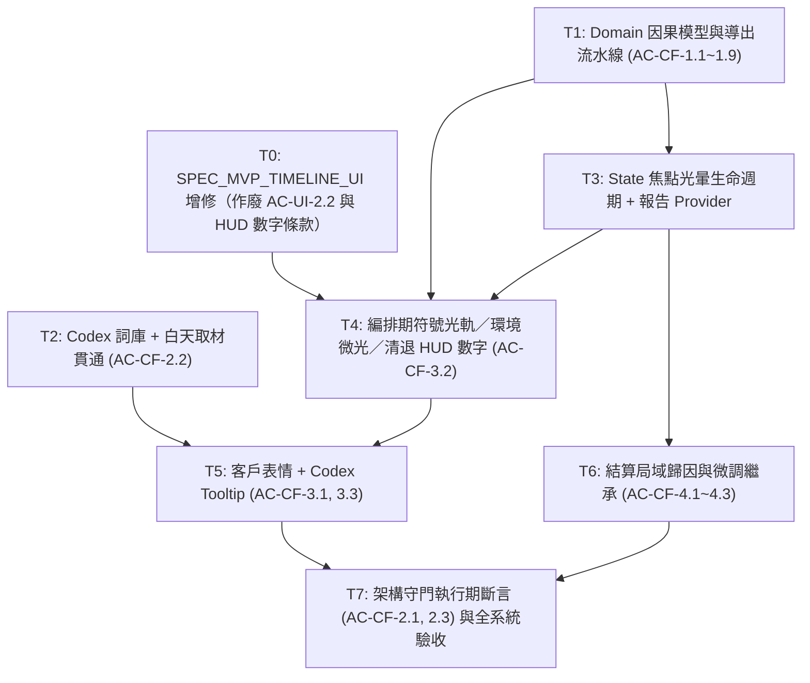

# PLAN — MVP 玩法因果可視化實作計劃

狀態：**Plan v3（對齊 SPEC v3）** — 待簽核
流程位置：`spec → 覆核 → plan → 覆核 → 執行計劃 → 覆核`
上位規格：`SPEC_MVP_CAUSAL_FEEDBACK.md` (v3)、`SPEC_MVP_CORE_LOOP.md`、`SPEC_MVP_TIMELINE_UI.md`
架構約束：`CLAUDE.md`、`CROSS_CUTTING_CONSTRAINTS.md`

> **v3 修訂摘要（相對 v2）**
> 1. 單一客戶表情，取消 `ClientIntentBar` 的雙頭像設計。
> 2. `causalReport` **不**進 `CuratorRunState`（它是導出值），只以 Provider 派生；`CuratorRunState` 僅新增 `focusedCulpritSlot` 這一項**非導出**的 UI 焦點狀態。
> 3. 補上 `copyWith` 的 `clearFocusedCulpritSlot` 旗標 —— 現有 `copyWith` 全為 `x ?? this.x`，直接傳 null 設不掉（專案已為 `selectedPhilosophy` 踩過同一個坑）。
> 4. Codex 移入 `domain/`：`lib/ui/` 目前零 `data/` 相依，不新開這條方向。
> 5. 刪除無法驗收的「120Hz 零掉幀」宣稱，改為可測的 rebuild 計數斷言。
> 6. 新增 T0（TIMELINE_UI + CORE_LOOP 文件增修，含校正 §2.3 過期數字）為硬前置；T1/T2 拓撲解耦。
> 7. 表情改由 `ReviewOutcome` 導出（統一 satisfaction 門檻會在社畜 50~59 分區間與實際評等分歧）；客戶具名 `personaName`；`purity_bonus` 定案不做編排期徽章。

---

## 1. 架構分層與檔案結構

```text
lib/
├── domain/core_loop/
│   ├── causal/
│   │   ├── causal_fact.dart              # [T1] 純 Dart 因果事實、強度、心態列舉與報告模型
│   │   ├── causal_report_builder.dart    # [T1] 由 stats/philosophy/client 導出報告的純函式
│   │   └── curator_codex.dart            # [T2] 世界觀行話詞庫（純文字、零具名城市）
│   ├── models/
│   │   └── travel_material.dart          # [T1] 新增 getter: bool get hasFatigueRisk => riskLevel >= 3;
│   └── run/
│       └── curator_run_state.dart        # [T3] 僅新增 focusedCulpritSlot + clearFocusedCulpritSlot
├── state/core_loop/
│   ├── curator_run_providers.dart        # [T3] itineraryCausalReportProvider（導出式 Provider）
│   └── curator_run_controller.dart       # [T3] tweakItinerary(culpritSlot) 與消褪政策
└── ui/core_loop/
    ├── curator_studio_modal.dart         # [T5] 裝配客戶表情列
    ├── review_settlement_modal.dart      # [T6] 局域歸因、策略提示、傳遞元兇槽位
    ├── components/
    │   ├── client_expression_tile.dart   # [T5] 單一客戶五態表情（Key('client_expression')）
    │   ├── causal_badge.dart             # [T4] 因果徽章（可點擊，承載 reasonCode）
    │   ├── codex_tooltip.dart            # [T5] Tap-to-Inspect 詞條氣泡
    │   ├── timeline_rail.dart            # [T4] 符號光軌：疲勞／連段／律動／共鳴
    │   ├── compact_slot_card.dart        # [T4] 槽位徽章、時段契合微光、元兇光暈
    │   └── live_preview_hud.dart         # [T4] 清退計分數字，保留成本與預算警示
    └── field/
        ├── attraction_detail_card.dart   # [T2] 白天卡面 [💀 拉車隱患]
        └── gathering_replace_bottom_sheet.dart # [T2] 同上

test/
├── domain/core_loop/causal_feedback_test.dart              # [T1] AC-CF-1.1~1.9
├── data/... （無新增；Codex 測試置於 domain）
├── domain/core_loop/curator_codex_test.dart                # [T2] AC-CF-2.2
├── state/core_loop/curator_run_causal_test.dart            # [T3] 光暈注入與消褪
├── ui/core_loop/causal_studio_ui_test.dart                 # [T4/T5] AC-CF-3.1~3.3
├── ui/core_loop/review_attribution_widget_test.dart        # [T6] AC-CF-4.1~4.3
└── architecture/causal_wiring_test.dart                    # [T7] AC-CF-2.1 / 2.3（執行期）
```

---

## 2. 抽象邊界與防線

依 `CLAUDE.md` §3「抽象只在擋住已知會變的軸時才做」：

1. **零新抽象**。`CausalFact`／`ItineraryCausalReport` 是不可變純資料；`CuratorCodex` 是靜態 `Map`；`CausalReportBuilder` 是純函式集合。不引入介面、不引入套件（CLAUDE.md §6）。
2. **單一真相源**。因果報告是 `ItineraryStats` + `TravelPhilosophy` + `ClientSpec` 的**純導出值**，因此：
   - **不**存入 `CuratorRunState`（存了就有兩份、就會不同步）。
   - 只在 `state/` 以 Provider 派生，UI 以 `.select` 訂閱所需切片。
   - 唯一例外是 `primaryCulpritSlot` 的**焦點狀態**：它是「玩家從結算帶回來的一次性 UI 意圖」，不是導出值，故存於 `CuratorRunState`。報告中的 `primaryCulpritSlot` 是計算結果，狀態中的是繼承下來的焦點，兩者命名相同但語意不同 —— 狀態欄位命名為 `focusedCulpritSlot` 以免混淆。
3. **值相等性（rebuild 抑制的前提）**。`CausalFact` 與 `ItineraryCausalReport` 覆寫 `operator ==` / `hashCode`。`facts` 是 `List`：
   ```dart
   // domain/ 不得 import package:flutter，listEquals 不可用，手寫：
   static bool _factsEqual(List<CausalFact> a, List<CausalFact> b) {
     if (identical(a, b)) return true;
     if (a.length != b.length) return false;
     for (var i = 0; i < a.length; i++) {
       if (a[i] != b[i]) return false;
     }
     return true;
   }
   // hashCode: Object.hash(Object.hashAll(facts), clientImpression, ...)
   ```
   未手寫則 `==` 恆為 false，抑制 rebuild 的理由整個落空（AC-CF-1.9 即為此而設）。
4. **分層純度**：
   - `domain/core_loop/causal/` 零 Flutter / Flame / `dart:ui`。
   - Codex 詞條文字零具名城市（沿用 `layer_boundaries_test.dart` 第 2 條規則涵蓋 `lib/domain`）。
   - UI 不得裸寫魔術數字：`riskLevel >= 3` 一律走 `material.hasFatigueRisk`；階梯判定一律讀 `CausalFact.intensity`。
5. **不改動計分規則**。本計劃只讀 `calculateStats` 與 `ClientReviewEngine` 的結果，不修改其中任何係數。

---

## 3. 任務拆解與相依拓撲



T1 與 T2 可並行（T2 只需要 `hasFatigueRisk` 這個 getter，可由 T2 自行補上，不必等整條流水線）。

### 3.1 任務清單

| 任務 | 內容 | 產出 | 對應 AC |
|---|---|---|---|
| **T0** | **前置文件增修（不改程式碼）**。<br>‧ `SPEC_MVP_TIMELINE_UI.md`：作廢 `AC-UI-2.2`（`+20% Combo` 文字）、改寫 §2.2C（HUD 只留 Cost 與預算警示）、移除客群視角切換器條款；明載 `AC-UI-2.3`／`AC-UI-2.4` 維持有效。<br>‧ 同檔 §2.3 的結算跳分數字**全部過期**（寫 70/30/−25/−15/×50%，現況為 `themeWeight 56`、`overspendPenaltyPoints 100`、`boredomHypeRatio 560`、疲勞 `targetHype × 14%`、`spotlightLadder [0.70…1.00]`），一併校正為現行公式。<br>‧ `SPEC_MVP_CORE_LOOP.md`：補 `ClientSpec.personaName` 的增修註記。 | `SPEC_MVP_TIMELINE_UI.md`<br>`SPEC_MVP_CORE_LOOP.md` | SPEC §6.1, §7.2 |
| **T1** | **Domain 因果模型與導出流水線**。建 `causal_fact.dart`（含手寫值相等）與 `causal_report_builder.dart`：<br>‧ 11 條 reasonCode 的導出，逐條對齊 SPEC §2.2 表格的既有計算。<br>‧ 疲勞 Theme 側／Hype 側分離；Hype 側僅在 `client.type == hypeInfluencer` 時存在。<br>‧ `clientImpression` 由 `ClientReviewEngine.evaluate()` 的 **`outcome`** 導出（非 `satisfaction` 門檻 —— 兩位客戶的退件分界不同），`rejected` 再依 `satisfaction >= 30` 拆 `stressed`/`furious`；`canSubmit == false` 時鎖 `neutral`。<br>‧ `primaryCulpritSlot` 依 SPEC §2.4 決定性優先序。<br>‧ `TravelMaterial` 補 `bool get hasFatigueRisk => riskLevel >= 3;`（類別內 getter，非 extension）。 | `domain/core_loop/causal/*`<br>`domain/core_loop/models/travel_material.dart`<br>`test/domain/core_loop/causal_feedback_test.dart` | AC-CF-1.1~1.9 |
| **T2** | **命名：Codex 詞庫、客戶具名與白天語意貫通**。<br>‧ `curator_codex.dart` 11 條詞條（`title` / `jargon` / `explanation` / `guideNote`）。<br>‧ `ClientSpec` 新增 `final String personaName`（`小林` / `安娜`）；`displayName` 保留為職稱。`operator ==` 只比 `type`，不受影響。<br>‧ `attraction_detail_card.dart` 與 `gathering_replace_bottom_sheet.dart` 於 `hasFatigueRisk` 時標 `[💀 拉車隱患]`。 | `domain/core_loop/causal/curator_codex.dart`<br>`domain/core_loop/review/client_spec.dart`<br>兩支 field UI<br>`test/domain/core_loop/curator_codex_test.dart` | AC-CF-2.2, SPEC §7.2 |
| **T3** | **State 焦點光暈生命週期**。<br>‧ `CuratorRunState` 新增 `final int? focusedCulpritSlot`，`copyWith` 同步新增 `bool clearFocusedCulpritSlot = false`（**必要**，否則設不回 null），並納入 `operator ==` / `hashCode`。<br>‧ `tweakItinerary({int? culpritSlot})` 注入焦點。<br>‧ 消褪政策：`placeMaterialInSlot` / `removeMaterialFromSlot` / `swapSlots` 內，若 `focusedCulpritSlot != null` 則以 `clearFocusedCulpritSlot: true` 清除。<br>‧ `itineraryCausalReportProvider`：以 `curatorRunControllerProvider` 的 itinerary/philosophy/client 導出報告。 | `curator_run_state.dart`<br>`curator_run_providers.dart`<br>`curator_run_controller.dart`<br>`test/state/core_loop/curator_run_causal_test.dart` | SPEC §2.4, §3.2.2 |
| **T4** | **編排期符號化與清退數字**。<br>‧ `causal_badge.dart`：統一徽章元件，持有 `reasonCode`、`sourceSignifier`、`intensity`，可點擊。<br>‧ `timeline_rail.dart`：`💀 拉車疲勞` / `⚡ 驚險連段` / `[律動]` / `[共鳴]`，移除 `+20% Combo` 字樣。<br>‧ `compact_slot_card.dart`：階梯徽章、`[時段契合]` 金色微光、`Key('highlight_culprit_slot')` 琥珀呼吸光暈（訂閱 `focusedCulpritSlot == index`）。**保留**牌面 `🔥`/`🎯` 屬性與相機倍率膠囊（SPEC §3.1.3）。<br>‧ `live_preview_hud.dart`：移除 `finalTheme` / `totalHype` 渲染與客群切換器，保留成本／預算警示與提交鈕。 | 三支 components<br>更新 `timeline_rail_widget_test.dart`、`live_preview_and_drawer_test.dart` | AC-CF-3.2 |
| **T5** | **客戶表情與 Codex 直通**。`client_expression_tile.dart` 以 `.select` 只訂閱 `clientImpression`，五態切換，`Key('client_expression')`，點擊出定性氣泡（文案以 `ClientSpec.personaName` 稱呼）。`codex_tooltip.dart` 依徽章 `reasonCode` 查 Codex 彈出詞條。裝配進 `curator_studio_modal.dart`。 | 兩支新元件 + studio modal<br>`test/ui/core_loop/causal_studio_ui_test.dart` | AC-CF-3.1, 3.3 |
| **T6** | **結算局域歸因與微調繼承**。歸因清單（超支元兇槽位與金額、疲勞時段對）；策略提示庫依主要失分項取樣，接受注入 `Random?`（CC-3）；「返回微調」呼叫 `tweakItinerary(culpritSlot: report.primaryCulpritSlot)`。禁止替換建議。 | `review_settlement_modal.dart`<br>`test/ui/core_loop/review_attribution_widget_test.dart` | AC-CF-4.1~4.3 |
| **T7** | **架構守門（執行期）與全系統驗收**。`causal_wiring_test.dart`：建構含全部 11 個 reasonCode 的報告 → 泵入工作台 → 逐條斷言 `sourceSignifier` 可見。附帶覆蓋 `rhythmActivePairs` / `comboActiveSlots` / `fatiguePairs` / `slotThemeBonuses` 四個擊穿欄位。 | `test/architecture/causal_wiring_test.dart` | AC-CF-2.1, 2.3 |

---

## 4. 效能與可驗收性

### 4.1 局部重繪（以可測方式表述）

不宣稱「120Hz 零掉幀」—— widget test 量不到幀率。改為可斷言的行為：

```dart
// 表情元件只訂閱心態切片
final impression = ref.watch(
  itineraryCausalReportProvider.select((r) => r.clientImpression),
);
// 槽位光暈只訂閱自己那一格
final isCulprit = ref.watch(
  curatorRunControllerProvider.select((s) => s.focusedCulpritSlot == slotIndex),
);
```

驗收方式：在元件內置入 build 計數器，測試「換一張不改變心態的卡 → 表情元件 build 次數不增加」。此斷言成立的前提正是 §2.3 的手寫值相等 —— 兩者是同一件事的兩端。

### 4.2 架構守門為什麼不能用字串掃描

UI 消費的是 `CausalFact` 物件，畫面上出現的是 `sourceSignifier`，原始碼裡**不會**出現 `'fatigue_spike'` 這類字面值。掃描原始碼找 reasonCode 必然是假綠燈；掃描到的那幾個欄位名（`.rhythmActivePairs` 等）也只證明「有人寫了這行」，不證明玩家看得到 —— 而這正是本案要修的原始病灶。故 T7 一律採執行期渲染斷言。

---

## 5. 驗收標準（DoD）

1. SPEC v3 的 **18 條 AC** 全數通過。
2. 編排期不顯示計分結果數字（Theme／Hype 加減量、`+20% Combo`），牌面屬性與相機倍率保留。
3. `causal_wiring_test.dart` 綠燈：11 個 reasonCode 於 UI 皆可見。
4. `layer_boundaries_test.dart` 五條全綠；`lib/domain/` 維持零 Flutter/Flame 相依。
5. `flutter analyze` 0 errors / 0 warnings。
6. `flutter test` 全套通過（`dart test` 在本倉庫不可用，無 `package:test` 直接相依）。
