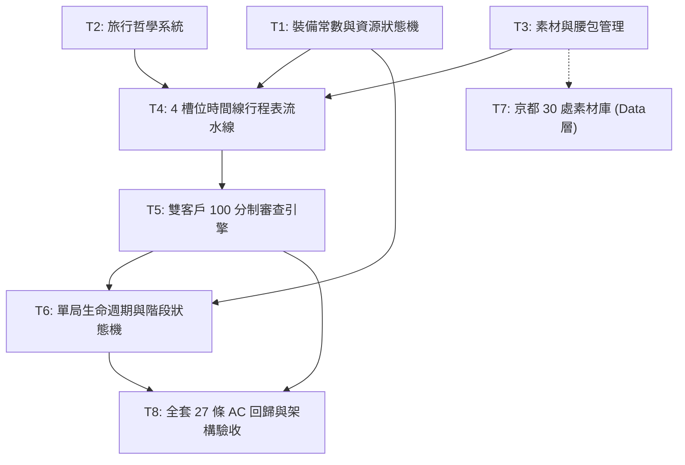

# 任務 M1：MVP 核心遊戲循環 — 實作計劃

狀態：**正式通過 (v2)** — 經資深軟體架構師與資深前端工程師聯合審查簽核：修正 27 條 AC 驗收標準、城市資料 DLC 解耦、前端 4 槽位草稿人體工學、連鎖擊穿資料結構與裝備相依拓撲
流程位置：`spec → 覆核 (完成) → plan → 覆核 (完成) → 執行計劃 (TDD 施工) → 覆核`
依據規格：`SPEC_MVP_CORE_LOOP.md` (v3)
上位約束：`CROSS_CUTTING_CONSTRAINTS.md` (v3)
工作規範：`CLAUDE.md`

---

## 1. 架構分層與目錄邊界

遵從 Clean Architecture 與 `CLAUDE.md §2, §4` 之嚴格分層原則：
1. **純領域層（Domain Layer）**：`lib/domain/core_loop/` 保持 100% 純 Dart，零框架依賴（無 Flutter/Flame 污染），且**絕不硬編碼具名城市資料**（「城市即實體 DLC」），保證純 `dart test` 秒級執行與 100% 可測性。
2. **資料與內容層（Data Layer）**：京都特色素材庫移置於 `lib/data/core_loop/`，領域層測試全面使用純合成測試夾具（Synthetic Fixtures），徹底落實解耦。
3. **前端人體工學友善（Frontend Ergonomics）**：領域模型全數提供 `const`、不可變集合（`List.unmodifiable`）、`copyWith`，並為 4 槽位時間線提供草稿容忍（`List<TravelMaterial?>`）與視覺擊穿資料（`ItineraryStats`），使 Riverpod 與 Flutter Widget 達成 120Hz 零掉幀流暢綁定。

```text
lib/
├── domain/
│   └── core_loop/                   # M1 純領域核心循環模組 (純 Dart，城市無關，零框架依賴)
│       ├── models/
│       │   ├── meta_equipment.dart       # 三件套裝備 (球鞋/相機/腰包) 等級與數值映射 (Value Objects)
│       │   ├── guide_resources.dart      # 阿導 3+1 核心資源狀態機 (HP, Budget, Theme, Hype)
│       │   ├── travel_philosophy.dart    # 5 大固定旅行哲學、偏好/排斥標籤權重
│       │   ├── travel_material.dart      # 旅行素材不可變實體 (Tag, Hype, Theme, Cost, Risk, isSpotlight)
│       │   ├── material_inventory.dart   # 腰包容量管理 (滿額 1 換 1)
│       │   ├── timeline_slot.dart        # 晨/午/暮/夜 4 槽位定義、偏好與加成規則
│       │   ├── timeline_itinerary.dart   # 4 槽位行程表草稿支援、連鎖擊穿資料結構 (ItineraryStats)
│       │   └── review_outcome.dart       # 審查結果枚舉與子步驟計分報告 (Subscores)
│       ├── review/
│       │   ├── client_spec.dart          # 委託客戶規格抽象
│       │   └── client_review_engine.dart # 社畜 (反無聊) 與網紅 (絕景打折+疲勞脫妝) 100分制審查引擎
│       └── run/
│           ├── curator_run_phase.dart    # 單局流程階段枚舉 (驅動 Flame Overlays)
│           └── curator_run_state.dart    # 單局生命週期狀態機、UUID 生成、結算事件與 Restart Run
├── data/
│   └── core_loop/
│       └── kyoto_night_catalog.dart      # 京都夜間 30 處特色旅行素材庫 (資料層，城市 DLC 實作)
test/
├── domain/
│   └── core_loop/
│       ├── meta_equipment_test.dart      # AC-ML-6 (三件套局外升級測試，3 條 AC)
│       ├── guide_resources_test.dart     # AC-ML-1 (資源狀態機測試，4 條 AC)
│       ├── travel_philosophy_test.dart   # AC-ML-2 (哲學偏好/排斥加成測試，3 條 AC)
│       ├── material_inventory_test.dart  # AC-ML-3 (腰包容量與替換測試，3 條 AC)
│       ├── timeline_itinerary_test.dart  # AC-ML-4 (時間線槽位、連鎖與拉車疲勞測試，6 條 AC)
│       ├── client_review_engine_test.dart# AC-ML-5 (雙客戶 100 分制與 Near Miss 測試，6 條 AC)
│       └── curator_run_lifecycle_test.dart # AC-ML-7 (單局結算與再來一局重置測試，2 條 AC)
└── data/
    └── core_loop/
        └── kyoto_night_catalog_test.dart # 京都素材資料庫自洽性測試
```

---

## 2. 任務拆解與執行順序 (Task Breakdown)

| 任務 | 內容與契約對應 | 產出檔案 | 對應 AC (合計 27 條) |
|---|---|---|---|
| **T1** | **裝備常數與阿導資源狀態機**<br>實作 `MetaEquipment` 值物件（球鞋 HP 擴充、腰包容量、相機倍率），以及 `GuideResources`（HP, Budget, Theme, Hype 邊界與 Clamp） | `domain/core_loop/models/meta_equipment.dart`<br>`domain/core_loop/models/guide_resources.dart` | **AC-ML-1.1 ~ 1.4** (4)<br>**AC-ML-6.1 ~ 6.3** (3) |
| **T2** | **五大旅行哲學系統**<br>實作 5 種哲學枚舉、偏好標籤一次性加成 (+50%) 與排斥標籤 (-50% & -5) 加權邏輯 | `domain/core_loop/models/travel_philosophy.dart` | **AC-ML-2.1 ~ 2.3** (3) |
| **T3** | **旅行素材與腰包容量管理**<br>實作不可變 `TravelMaterial`（含 `isSpotlight`、`storyValue`）與具備滿額替換的 `MaterialInventory` | `domain/core_loop/models/travel_material.dart`<br>`domain/core_loop/models/material_inventory.dart` | **AC-ML-3.1 ~ 3.3** (3) |
| **T4** | **4 槽位時間線行程表與擊穿流水線**<br>實作 4 槽位草稿支援（`List<TravelMaterial?>`）、黃昏相機倍率、Slot 0 晨曦加分、Slot 1 午後中繼加分、Slot 3 深夜加分、相鄰標籤 Combo 取整、拉車疲勞扣分，並輸出具備視覺擊穿的 `ItineraryStats` | `domain/core_loop/models/timeline_slot.dart`<br>`domain/core_loop/models/timeline_itinerary.dart` | **AC-ML-4.1 ~ 4.6** (6) |
| **T5** | **雙客戶 100 分制審查引擎**<br>實作社畜控費（每超支 10 円扣 2 分、反無聊 Hype<30 扣 25 分）與網紅爆點（絕景打五折、疲勞脫妝扣 15 Hype、主題加權係數）雙軌審查，輸出含分步子分數（Subscores）的 `ReviewReport` | `domain/core_loop/review/client_spec.dart`<br>`domain/core_loop/review/client_review_engine.dart`<br>`domain/core_loop/models/review_outcome.dart` | **AC-ML-5.1 ~ 5.6** (6) |
| **T6** | **單局生命週期與流程階段**<br>實作 `CuratorRunPhase` 枚舉、單局 UUID 實體識別（CC-1）、決定性結算事件產出（CC-3）與 `Restart Run` 狀態重置 | `domain/core_loop/run/curator_run_phase.dart`<br>`domain/core_loop/run/curator_run_state.dart` | **AC-ML-7.1 ~ 7.2** (2) |
| **T7** | **京都夜間 30 處旅行素材資料庫**<br>於 `data/` 層建立京都夜間特色種子素材庫，提供圖資 DLC 內容（解耦於領域核心） | `data/core_loop/kyoto_night_catalog.dart` | 內容資料驗證 |
| **T8** | **架構邊界檢驗與全套 27 條 AC 回歸**<br>將新模組納入 `layer_boundaries_test.dart` 檢查，執行 `flutter test` 與 `analyze` 達成全綠燈驗收 | `test/architecture/layer_boundaries_test.dart` | 全系統驗收 |

---

## 3. 任務相依圖與關鍵路徑



* **關鍵路徑 (Critical Path)**：`T1/T3 ➔ T4 ➔ T5 ➔ T6 ➔ T8`。
* **相依拓撲說明**：
  * T1 提前定義裝備值物件，徹底解除 T1（HP 上限）與 T3（腰包容量）對 T6 的逆向相依。
  * T4 依賴 T3（素材）與 T2（哲學倍率）。
  * T5 依賴 T4 的行程表產物（Cost, Hype, Theme, Story, Fatigue）。
  * T7 移出領域層，不阻擋 T8 純領域核心 27 條 AC 的閉環驗收。

---

## 4. 前端資料人體工學規範 (Frontend Ergonomics Contract)

為確保未來與 Flutter Widget、Riverpod Notifier 及 Flame Overlays 達到 120Hz 零掉幀絲滑對接：
1. **草稿槽位支援**：`TimelineItinerary` 內部槽位為 `List<TravelMaterial?>`（長度固定為 4），允許未填滿的草稿狀態，並提供 `bool get canSubmit => slots.every((s) => s != null)`。
2. **視覺擊穿資料（View-Ready Breakdown）**：流水線回傳之 `ItineraryStats` 包含 `comboActiveSlots`（連鎖槽位集合）、`fatiguePairs`（拉車疲勞配對）與 `slotEffectiveHypes`，供前端 UI 直接繪製光效與骷髏警示，無需重複判定。
3. **分步滾動計分**：`ReviewReport` 內含 `budgetSubscore`, `themeSubscore`, `boredomPenalty`, `effectiveHype` 等子分數，支援結算彈窗逐行跳動與蓋印動畫。
4. **階段切換驅動**：`CuratorRunPhase` 提供 `philosophizing`, `fieldTrip`, `nightEditing`, `clientReview`, `settled` 枚舉，聲明式驅動 UI Overlays。
5. **純同步無副作用**：計算流水線保持純同步函式（執行時間 < 10µs），保證拖曳排序時幀率穩定維持 60/120fps。

---

## 5. 驗收標準 (DoD - Definition of Done)

1. **功能完整性（27 條 AC 零遺漏）**：
   - `AC-ML-1.1 ~ 1.4`（資源狀態機，4 條）
   - `AC-ML-2.1 ~ 2.3`（旅行哲學，3 條）
   - `AC-ML-3.1 ~ 3.3`（腰包容量，3 條）
   - `AC-ML-4.1 ~ 4.6`（時間線 4 槽位與加成，6 條）
   - `AC-ML-5.1 ~ 5.6`（雙客戶 100 分制審查，6 條）
   - `AC-ML-6.1 ~ 6.3`（局外裝備升級，3 條）
   - `AC-ML-7.1 ~ 7.2`（單局結算與生命週期，2 條）
   - **全數 27 條 AC 單元測試綠燈通過，無跳過或註解**。
2. **架構健全度**：
   - `lib/domain/core_loop/` 底下無任何 Flutter、Flame、Platform 框架引用，亦無具名城市硬編碼。
   - `test/architecture/layer_boundaries_test.dart` 綠燈通過。
   - 所有測試可透過純命令列 `dart test test/domain/core_loop/` 在 2 秒內秒級跑完。
3. **代碼品質**：
   - `flutter analyze` 保持 0 errors, 0 warnings, 0 lints。
