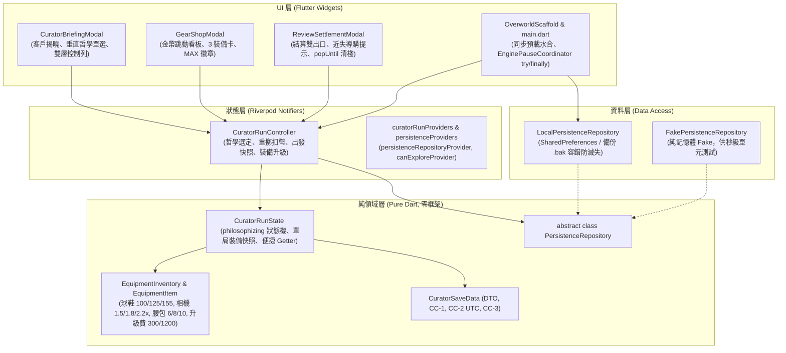
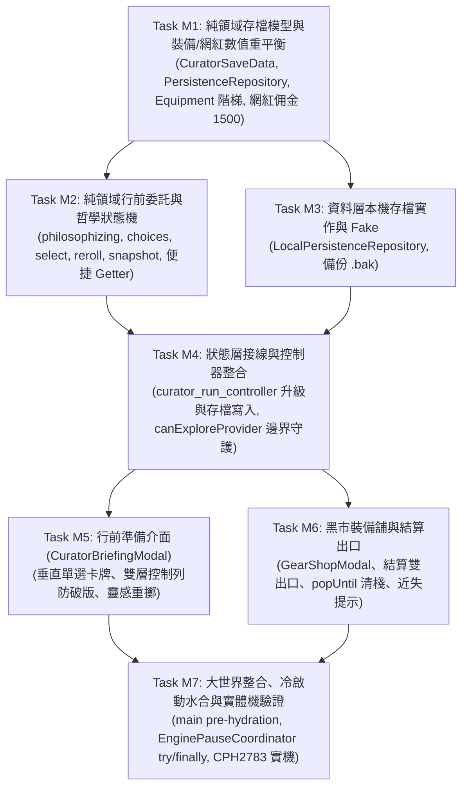

# Milestone M4 實作計劃：阿導行前委託、黑市裝備升級與本機存檔 (PLAN_MVP_META_PROGRESSION)

> **版本**：v2 (雙架構師覆核通過版 - Formal Approval)  
> **關聯規格**：[`SPEC_MVP_META_PROGRESSION.md`](file:///Users/appgongyong/share_tour/SPEC_MVP_META_PROGRESSION.md) (v2)  
> **目標**：以嚴格 TDD 模式（Red-Green-Refactor）落實行前準備、黑市裝備舖、存檔持久化與 360dp 人體工學防護，完成 Roguelite 永久成長閉環。  
> **架構邊界**：維持 Clean Architecture，純領域零框架依賴；以 `PersistenceRepository` 解耦本機/未來遠端；在 `main()` 實現同步預載水合。

---

## 1. 模組架構拓撲與分層 (Architectural Topology)

---

## 2. 任務分解與相依圖 (Task Dependency Graph)

---

## 3. 任務詳細規格與 TDD 步驟 (Detailed Task Specifications)

### Task M1: 純領域存檔模型與裝備數值重平衡
- **目錄與檔案**：
  - `lib/domain/core_loop/models/curator_save_data.dart` (新增)
  - `lib/domain/core_loop/models/persistence_repository.dart` (新增)
  - `lib/domain/core_loop/models/meta_equipment.dart` (修改：更新數值階梯與便捷 Getter)
  - `lib/domain/core_loop/review/client_spec.dart` (修改：將 `hypeInfluencer.baseCommission` 修正為 1500)
  - `lib/domain/core_loop/models/core_loop_exceptions.dart` (修改：新增 `PreconditionFailedException`)
  - `test/domain/core_loop/meta_progression_domain_test.dart` (新增測試)
- **職責與行為**：
  - `CuratorSaveData` 具備 `profileId` (UUID, CC-1)、`saveVersion` (1)、`lastMonotonicSeq` (0, CC-3)、`coins`、`sneakersLevel`、`cameraLevel`、`waistBagLevel`、`completedRuns`、`updatedAtUtc` (CC-2)。
    - 建構子強制保證 `assert(updatedAtUtc.isUtc, 'updatedAtUtc must be in UTC')`。
  - `toJson()` / `fromJson()` 序列化。
  - `EquipmentItem` 數值重平衡與便捷 Getter：
    - 球鞋 `maxHp`: Lv.1 `100`, Lv.2 `125`, Lv.3 `155`。
    - 相機 `cameraMultiplier`: Lv.1 `1.5`, Lv.2 `1.8`, Lv.3 `2.2`。
    - 腰包 `capacity`: Lv.1 `6`, Lv.2 `8`, Lv.3 `10`。
    - 升級費用 `nextUpgradeCost`: Lv.1 $\rightarrow$ 2 為 `300` 幣，Lv.2 $\rightarrow$ 3 為 `1200` 幣，Lv.3 為 `null`。
    - 擴展 Getter：`bool get isMaxLevel => level >= 3;`、`bool canAffordUpgrade(int currentCoins)`。
  - `ClientSpec.hypeInfluencer` 基礎佣金調整為 `1500`（Pass 1500、Near Miss 450、Perfect 2250），嚴格匹配 SPEC v2。
  - `PersistenceRepository` 純抽象介面：`loadSave()`, `save(CuratorSaveData)`, `clearSave()`。
- **AC 映射**：AC-M4-2.1, AC-M4-2.2, AC-M4-2.3, AC-M4-3.2, AC-M4-3.4。

---

### Task M2: 純領域行前委託與哲學狀態機
- **目錄與檔案**：
  - `lib/domain/core_loop/run/curator_run_state.dart` (修改)
  - `test/domain/core_loop/briefing_domain_test.dart` (新增測試)
- **職責與行為**：
  - `CuratorRunState` 擴展欄位：
    - `final List<TravelPhilosophy> philosophyChoices` (固定 3 張不重複哲學候選)
    - `final TravelPhilosophy? selectedPhilosophy` (選定項，未選為 null)
    - `final int rerollsUsed` (已重擲次數)
    - `final EquipmentInventory equipmentSnapshot` (出發時鎖定之裝備快照)
  - 便捷 View Getter：
    - `bool get canDepart => selectedPhilosophy != null;`
    - `int get nextRerollCost => (rerollsUsed == 0 && equipment.coins == 0) ? 0 : 100;`
    - `bool get canReroll => nextRerollCost == 0 || equipment.coins >= nextRerollCost;`
  - 狀態轉移與作弊防護：
    - `CuratorRunState.createBriefing({required EquipmentInventory equipment, ClientSpec? client, String? runId, Random? random})`：生成 3 張隨機候選卡。
    - `selectPhilosophy(TravelPhilosophy choice)`：設定 `selectedPhilosophy`。
    - `rerollPhilosophies({Random? random})`：首局零幣時免費，其餘扣除 100 幣（不足拋出 `InsufficientCoinsException`），生成 3 張新候選卡，`rerollsUsed` 遞增。
    - `departToFieldTrip()`：若 `selectedPhilosophy == null` 拋出 `PreconditionFailedException`；選定後狀態轉為 `fieldTrip`，`philosophy = selectedPhilosophy!`，`equipmentSnapshot = equipment`，HP 依 `equipmentSnapshot.sneakers.maxHp` 回滿，腰包容量依 `equipmentSnapshot.waistBag.capacity` 初始化。
    - **漏洞根除**：將 `curator_run_state.dart` 中的 `currentStats` 運算改為讀取 `equipmentSnapshot.camera.cameraMultiplier`，徹底杜絕單局中途升級追溯放大 Hype 的作弊洞。
- **AC 映射**：AC-M4-1.1, AC-M4-1.2, AC-M4-1.3, AC-M4-1.4, AC-M4-1.5, AC-M4-2.4。

---

### Task M3: 資料層本機存檔實作與 Fake
- **目錄與檔案**：
  - `lib/data/core_loop/local_persistence_repository.dart` (新增)
  - `test/fakes/fake_persistence_repository.dart` (新增)
  - `test/data/core_loop/local_persistence_repository_test.dart` (新增測試)
- **職責與行為**：
  - `FakePersistenceRepository`：純記憶體存儲，支援模擬損毀與空存檔。
  - `LocalPersistenceRepository`：使用 `SharedPreferences` 儲存 JSON 字串。
  - 損毀防護：若 JSON 解析拋出異常，將損毀資料保存至 `save_corrupted_<timestamp>.bak` 鍵值，並回傳預設初始 `CuratorSaveData.initial()`，不拋出未捕捉崩潰。
- **AC 映射**：AC-M4-3.1, AC-M4-3.2, AC-M4-3.3, AC-M4-3.4。

---

### Task M4: 狀態層接線與控制器整合
- **目錄與檔案**：
  - `lib/state/core_loop/persistence_providers.dart` (新增)
  - `lib/state/core_loop/curator_run_providers.dart` (修改：修復 `canExploreProvider` 穿透問題)
  - `lib/state/core_loop/curator_run_controller.dart` (修改)
  - `test/state/core_loop/meta_progression_controller_test.dart` (新增測試)
- **職責與行為**：
  - 定義 `persistenceRepositoryProvider` 與 `initialSaveDataProvider`。
  - 邊界防護：將 `canExploreProvider` 嚴格限制為 `state.phase == CuratorRunPhase.fieldTrip && !state.resources.isExhausted`，徹底防範在行前準備 Modal 下地圖穿透移動。
  - `CuratorRunController` 整合：
    - `selectPhilosophy(TravelPhilosophy choice)`
    - `rerollPhilosophies()`：調用領域層並同步儲存金幣變更。
    - `departToFieldTrip()`
    - `upgradeEquipment(EquipmentType type)`：扣除金幣升級裝備，即時呼叫 `_persistence.save(...)` 存檔。
    - `acceptReview()`：將 `latestReport.earnedCoins` 累加進局外 `equipment.coins`，即時寫入存檔。
    - `startNewBriefing({ClientSpec? client})`：開啟新局進入 `philosophizing`。
- **AC 映射**：AC-M4-1.1 ~ 1.5, AC-M4-2.1 ~ 2.4, AC-M4-3.1。

---

### Task M5: 行前準備介面 (CuratorBriefingModal)
- **目錄與檔案**：
  - `lib/ui/core_loop/briefing/curator_briefing_modal.dart` (新增)
  - `test/ui/core_loop/curator_briefing_modal_test.dart` (新增測試)
- **職責與行為**：
  - 滿版底抽屜，背景黑色半透明遮罩。
  - 頂部：今日委託客戶卡（社畜 / 網紅、預算上限、雷點警示）。
  - 中部：3 張哲學卡**垂直排列單選清單**（SingleChildScrollView 滾動防護，360dp 防破版，金句、加扣分標籤、金色選中外框）。
  - 底部控制列（**雙層結構，徹底根絕 360dp RenderFlex overflow**）：
    - 上層（次要動作列）：
      - `[🎲 換一批 (首局免費 / 100幣)]` 靈感重擲按鈕。
      - `[🛒 黑市裝備舖]` 入口按鈕。
    - 下層（主要行動列）：
      - `[🚀 出發踩線！]` 全寬主按鈕（`canDepart == false` 時禁用）。
- **AC 映射**：AC-M4-4.1, AC-M4-1.2。

---

### Task M6: 黑市裝備舖與結算出口
- **目錄與檔案**：
  - `lib/ui/core_loop/gear_shop/gear_shop_modal.dart` (新增)
  - `lib/ui/core_loop/review_settlement_modal.dart` (修改)
  - `test/ui/core_loop/gear_shop_modal_test.dart` (新增測試)
  - `test/ui/core_loop/review_settlement_widget_test.dart` (修改)
- **職責與行為**：
  - `GearShopModal`：
    - 頂部金幣計數看板（`🪙 金幣: 1,200`，微縮放跳字動畫）。
    - 3 張裝備卡（球鞋、相機、腰包），垂直滾動排列，標註當前與升級數值（`HP 100 ➔ 125`、`容量 6 ➔ 8`）。
    - 升級按鈕：餘額足夠亮橘色、不足灰階禁觸、滿級金色「MAX」徽章。
    - 附註說明：「升級成功！效果於下一局生效」。
  - `ReviewSettlementModal` 修改：
    - 點擊「💰 收下佣金」後切換至結算完成摘要頁，提供 `[🛒 前往黑市裝備舖]` 與 `[🔄 再來一局]`，杜絕玩家被困在大地圖。
    - 若為 Near Miss，注入反事實導購提示（*「要是黃昏再震撼一點就好了... 📸 相機目前 Lv.1，升至 Lv.2 可提升加成！」*）。
    - 點擊「再來一局」時執行 `Navigator.of(context).popUntil((r) => r.isFirst)` 清空所有 Modal 堆疊，確保乾淨啟動新局。
- **AC 映射**：AC-M4-4.2, AC-M4-4.3。

---

### Task M7: 大世界整合、冷啟動水合與實體機驗證
- **目錄與檔案**：
  - `lib/main.dart` (修改：同步預載水合、EnginePauseCoordinator try/finally、啟動自動開局引導)
  - 全套自動化測試回歸（目標 $\approx$ 335+ 測試 100% 通過）
  - `flutter analyze` 零告警驗證
  - Android 實體機 (`CPH2783`, `EMD6VSPZV8MFBMDI`) 真機部署與功能截圖
  - Git commit & push
- **職責與行為**：
  - `main()` 啟動前置 `await (TaiwanMapManifest.load(), repo.loadSave()).wait` 同步水合，首幀即有正確存檔資料，零 FOUC。
  - `EnginePauseCoordinator` 協調 Modal 堆疊時的 Flame 暫停與恢復，使用 `try/finally` 包覆 `showModalBottomSheet`，保證側滑返回或點擊遮罩時引用計數絕不洩漏。
  - 實體手機全流程驗收：行前揭曉 ➔ 哲學選定 ➔ 大世界踩線 ➔ 時間線排程 ➔ 客戶審查 ➔ 黑市裝備升級 ➔ 存檔保留關閉 App 重開驗證。
- **AC 映射**：AC-M4-4.4, 全 AC 實機驗收。

---

## 4. 驗收標準與完成定義 (Definition of Done)

1. **分層純淨度**：`domain/` 維持零 Flutter/Flame 框架污染，`test/architecture/layer_boundaries_test.dart` 100% 通過。
2. **測試覆蓋率**：新增約 20~25 項單元與整合測試，全庫測試（335+）全部通過。
3. **靜態分析**：`flutter analyze` 零 issues。
4. **實體機驗收存證**：在 `CPH2783` 實機上截圖驗證：
   - 行前準備介面與哲學垂直卡牌
   - 黑市裝備舖升級球鞋至 Lv.2 (HP 125)
   - 審查結算後金幣入帳與 Near Miss 導購提示
   - 關閉 App 重新開啟，存檔資料完整還原。

