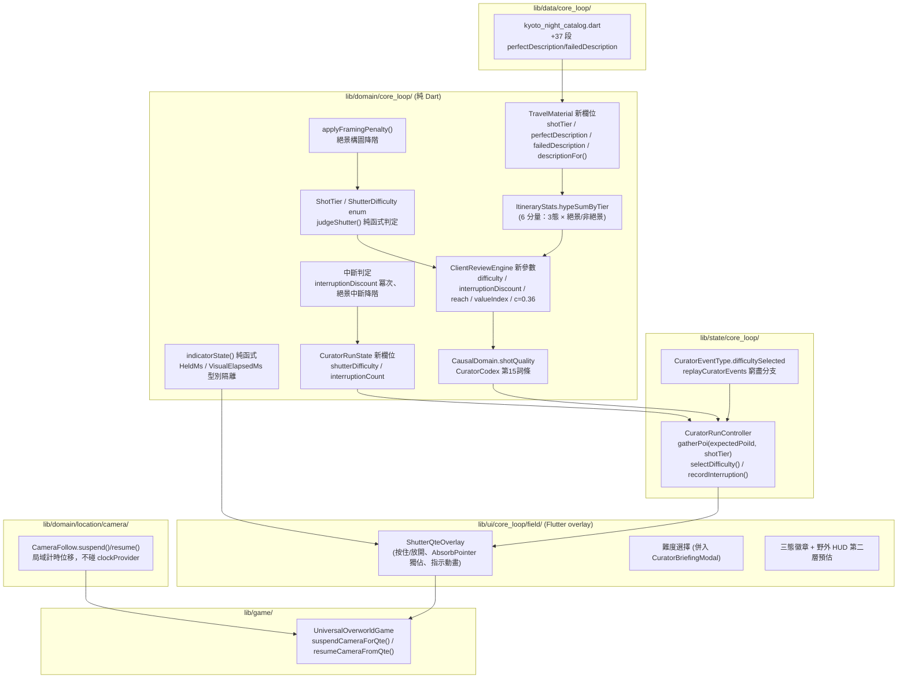
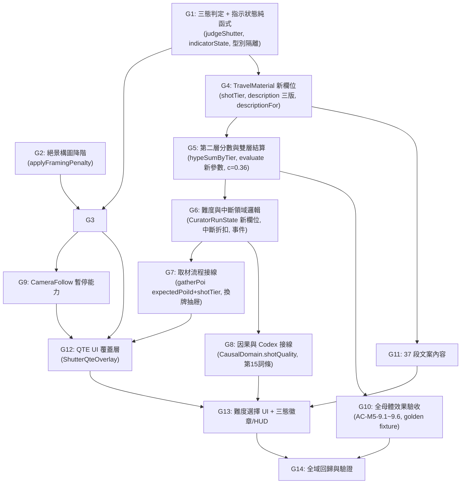

# PLAN — 《Share Tour：奇葩旅行策展人》Milestone M5：快門微動作與雙層結算

- 狀態：**施工中（TDD）**
- 流程位置：`spec (通過，v9) → 覆核 (通過，八輪雙軌) → plan (本文件) → 覆核 (使用者授權跳過，見下) → 執行計劃 (TDD，本文件同步執行) → 覆核`
- 上位文件：`SPEC_MVP_MICRO_ACTION.md`（v9，1172 行）、`CROSS_CUTTING_CONSTRAINTS.md`、`CLAUDE.md`

> **本輪流程裁決**：使用者已明確授權「整個 M5 一路做到底，不要再等點頭」，覆蓋 `CLAUDE.md` §1 逐關點頭規則。本文件因此兼作 plan 與執行計劃，任務逐一 TDD 完成並提交，不在關卡間暫停徵詢。

---

## 0. 前置狀態核實（避免依賴已清償或已存在的假設）

寫 plan 前重新核實 SPEC §5 前置條件在本 worktree 的實際狀態：

| SPEC §5 前置 | 狀態 | 依據 |
|---|---|---|
| 1. Golden fixture（AC-M5-9.3） | **未擷取**，本 plan G8 任務處理 | `test/fixtures/` 現只有 GPS 相關檔案 |
| 2. 因果可視化已合入主線 | **已滿足**——本 worktree 基底 `0d83843` 的祖先鏈已含 `lib/domain/core_loop/causal/`（`causal_fact.dart`／`curator_codex.dart`／`causal_report_builder.dart`），非空外部依賴 | `git log --oneline --all \| grep causal`、`ls lib/domain/core_loop/causal/` |
| 3. `SPEC_MVP_POI_GATHERING.md` §1.3 增修 | 順手處理，一行文件修訂 | — |
| 4. `gatherPoi()` 補 `expectedPoiId` | **未修**，本 plan G5 任務處理（`replaceGatheredPoi` 已有此防護可參照） | `curator_run_controller.dart:66-125` |
| 5. `CameraFollow` 讀出點與可暫停 | **未修**，本 plan G7 任務處理 | `camera_follow.dart` 全檔已讀 |
| 6. `SPEC_MVP_CORE_LOOP.md` 範圍表增修 | 順手處理 | — |
| 7. 37 段文案 | **未寫**，本 plan G9 任務處理 | — |
| 8. `CuratorEventType` 窮盡 switch 會炸 | 預期中，G6 任務新增 `difficultySelected` 時處理 | `curator_event_replay.dart:32` 確認無 `default` |
| 9. `CuratorCodex` 硬編 14 的兩條測試 | 待 G10 任務同步改為 15 | `test/domain/core_loop/curator_codex_test.dart:24`、`test/ui/core_loop/causal_studio_ui_test.dart:248` |

**另有一項與 M5 無關但會擋住全域 `flutter analyze`／`flutter test` 的既有缺陷**：`lib/main.dart:116,120` 呼叫 `LocationNotifier.switchManifest`／`UniversalOverworldGame.switchMap`，兩個方法在本 worktree 不存在——這是另一支平行分支（地方層地圖切換，`TASK_D_LOCAL_TIER_PROPOSAL.md`）留下的未完成整合，**不在本 SPEC 範圍**，本 plan 不實作該功能。驗證階段（G12）將 `flutter analyze` 範圍限定在 M5 觸及的目錄，並在最終報告中明確揭露此既有缺陷未被本輪修復。

---

## 1. 架構原則與分層拓撲

- **`domain/core_loop/`**：三態判定、難度參數表（含絕景專屬表）、指示狀態純函式、第二層分數公式、`TravelMaterial` 新欄位、`ItineraryStats.hypeSumByTier`、`ClientReviewEngine` 新參數、中斷判定、因果 `shotQuality` 事實。全數零 Flutter/Flame 相依，`dart test` 可跑。
- **`domain/location/camera/`**：`CameraFollow` 新增局域可暫停能力，不碰共用 `clockProvider`。
- **`state/core_loop/`**：`CuratorRunController` 新增難度鎖定、`gatherPoi` 的 `expectedPoiId`／`shotTier` 參數、中斷計數、事件持久化。
- **`ui/core_loop/field/`**：QTE 覆蓋層（新檔）、難度選擇（併入既有行前 Modal）、三態徽章、野外 HUD 第二層預估。
- **`game/`**：`UniversalOverworldGame` 新增相機暫停掛鉤（供 UI 層 QTE 呼叫）。
- **`data/core_loop/`**：京都卡表新增 37 段文案字面量。



## 2. 任務拆解與相依拓撲



---

## 3. 各任務施工規格與 TDD 步驟

### 任務 G1：三態判定純函式與指示狀態 `[P0]`
- **目標**：完成 `pressed(Δt)`/`timedOut` 和型別判定、非絕景與絕景兩張 `tierFactor` 表、`indicatorState` 純函式、判定/視覺型別隔離。
- **施工內容**：
  1. `lib/domain/core_loop/models/shot_tier.dart`（新）：`enum ShotTier { failed, normal, perfect }`。
  2. `lib/domain/core_loop/models/shutter_difficulty.dart`（新）：`enum ShutterDifficulty { tourist, photographer, decisiveMoment }`。
  3. `lib/domain/core_loop/shutter/held_ms.dart`（新）：`class HeldMs`——建構子只接受 `Duration downTimeStamp, Duration upTimeStamp`，內部算 `(up - down).inMilliseconds`，`toInt()` 取值。杜絕裸 `int` 誤餵（AC-M5-1.13）。
  4. `lib/domain/core_loop/shutter/visual_elapsed_ms.dart`（新）：`class VisualElapsedMs`——包一個 `int`，與 `HeldMs` 型別不相容。
  5. `lib/domain/core_loop/shutter/shutter_input.dart`（新）：和型別 `sealed class ShutterInput`，兩個子類 `Pressed(HeldMs heldMs)`／`TimedOut()`。
  6. `lib/domain/core_loop/shutter/shutter_params.dart`（新）：
     - `class DifficultyTiming`：`tMatchMs, perfectWindowMs, normalWindowMs (nullable), animationLengthMs`。
     - `const Map<ShutterDifficulty, DifficultyTiming> kDifficultyTimings`：依 SPEC REQ-M5-01.8（`tourist` 1400/800/null/2000、`photographer` 1100/160/720/1600、`decisiveMoment` 800/120/300/1200）。
     - `const Map<ShutterDifficulty, (double failed, double normal, double perfect)> kNonSpotlightTierFactor`：`tourist` (0.90,1.00,1.05)、`photographer` (0.72,1.00,1.22)、`decisiveMoment` (0.62,1.00,1.70)。
     - `const Map<ShutterDifficulty, (double failed, double normal, double perfect)> kSpotlightTierFactor`：`tourist` 同非絕景、`photographer` (0.938,1.00,1.292)、`decisiveMoment` (0.735,1.00,2.031)。
     - `double tierFactorFor(ShutterDifficulty difficulty, ShotTier tier, {required bool isSpotlight})`：查表工具函式。
  7. `lib/domain/core_loop/shutter/shutter_judge.dart`（新）：
     - `ShotTier judgeShutter(ShutterInput input, ShutterDifficulty difficulty)`：
       - `TimedOut()` → 恆 `ShotTier.failed`。
       - `Pressed(heldMs)` → 依 `kDifficultyTimings[difficulty]` 算 $\Delta t = |heldMs.toInt() - tMatchMs|$，$\le W_p/2$ 為 `perfect`；`normalWindowMs` 為 `null` 或 $\Delta t \le W_n/2$ 為 `normal`；否則 `failed`。純函式，不出現 `DateTime.now`／`Random`（AC-M5-1.7）。
  8. `lib/domain/core_loop/shutter/indicator_state.dart`（新）：
     - `enum IndicatorState { beforeMatch, pastMatch, timedOut }`。
     - `IndicatorState indicatorState(VisualElapsedMs visualElapsedMs, ShutterDifficulty difficulty)`：`visualElapsedMs >= animationLengthMs` → `timedOut`；`>= tMatchMs` → `pastMatch`；否則 `beforeMatch`。
- **測試驗證**（`test/domain/core_loop/shutter/`）：
  - `shutter_judge_test.dart`：AC-M5-1.1~1.8（含 `tourist` 恆無 `failed`、`timedOut` 恆 `failed`、$W_p \ge 120$、1000 次重複一致、靜態檢查原始碼不含 `riskLevel`/`cameraLevel`/`DateTime.now`/`Random`）。
  - `indicator_state_test.dart`：AC-M5-11.5（`pastMatch` 邊界）、AC-M5-11.7（1 ms 步長掃 $[0, t_{match})$ 恆 `beforeMatch`）。
  - `held_ms_visual_elapsed_ms_test.dart`：AC-M5-1.13——嘗試把 `VisualElapsedMs` 傳進 `judgeShutter` 應為編譯期錯誤（此案例以「型別不同名、無隱式轉換」的靜態事實驗證，寫一則註解說明，不強寫會編譯失敗的程式碼片段）。
  - `shutter_params_test.dart`：AC-M5-2.3（兩張表逐格核對）、AC-M5-1.4（$W_p \ge 120$ 全難度）、AC-M5-1.9/1.10 相關常數存在性。

### 任務 G2：絕景構圖降階 `[P0]`
- **目標**：構圖二元判定與降階規則，供中斷路徑重用。
- **施工內容**：
  1. `lib/domain/core_loop/shutter/framing_penalty.dart`（新）：
     - `ShotTier applyFramingPenalty(ShotTier timingTier, {required bool framingOk})`：`framingOk == true` → 原樣回傳；`false` → 降一階（`perfect→normal`、`normal→failed`、`failed→failed`）。
     - `bool framingOk(double compositionOffset, double maxOffset)`：`compositionOffset <= maxOffset`。$d_{c,\max}$ 座標空間定案為**取景框邊長比例**（0.0~1.0），三檔各一個門檻常數 `kFramingMaxOffset`（`tourist` 0.25、`photographer` 0.18、`decisiveMoment` 0.12，依 SPEC §6 待決 2 建議值定案）。
- **測試驗證**（`test/domain/core_loop/shutter/framing_penalty_test.dart`）：AC-M5-4.2（3×2 真值表全覆蓋）。

### 任務 G3：三態判定與構圖整合的公開入口 `[P0]`
- **目標**：把 G1/G2 組成單一對外呼叫（`isSpotlight` 決定是否套構圖），供 state/UI 層使用同一個入口，避免各自組裝順序不一致。
- **施工內容**：
  1. `lib/domain/core_loop/shutter/shutter_result.dart`（新）：`ShotTier resolveShotTier({required ShutterInput input, required ShutterDifficulty difficulty, required bool isSpotlight, double? compositionOffset})`——非絕景直接回傳 `judgeShutter` 結果；絕景先算 `judgeShutter` 再套 `applyFramingPenalty`（`compositionOffset` 為 `null` 時視為不通過，供中斷路徑重用，REQ-M5-04.2）。
- **測試驗證**（`test/domain/core_loop/shutter/shutter_result_test.dart`）：AC-M5-4.1（分派）、REQ-M5-04.2 的「絕景中斷視為構圖不通過」（`compositionOffset: null` 分支）。

### 任務 G4：`TravelMaterial` 三態文案欄位 `[P0]`
- **目標**：新增 `shotTier`、`perfectDescription`、`failedDescription`、`descriptionFor()`，維持既有相等語意與建構式不變（純加法）。
- **施工內容**：
  1. `lib/domain/core_loop/models/travel_material.dart`：
     - 建構子新增 `this.shotTier = ShotTier.normal`、`this.perfectDescription`（`String?`，預設 `null`）、`this.failedDescription`（`String?`，預設 `null`）。
     - 新增方法 `String descriptionFor(ShotTier tier) => switch (tier) { ShotTier.normal => description, ShotTier.perfect => perfectDescription ?? description, ShotTier.failed => failedDescription ?? description }`。
     - `copyWith` 新增對應三參數。
     - `==`／`hashCode`：**不**納入 `shotTier`／`perfectDescription`／`failedDescription`／`description`（比照現行 `description` 已被排除的慣例——三態變體本應视為同一張卡）。
- **測試驗證**（`test/domain/core_loop/models/travel_material_test.dart` 新增區塊）：
  - AC-M5-2.2（凍結欄位清單：三態變體除 `shotTier`/`description` 外全等）。
  - AC-M5-2.6（`shotTier` 預設 `normal`，既有建構呼叫零改動即通過——跑一次既有測試檔確認）。
  - `descriptionFor` 回退語意（`perfectDescription`/`failedDescription` 為 `null` 時回退 `description`）。

### 任務 G5：第二層分數與雙層結算 `[P0]`
- **目標**：`ItineraryStats.hypeSumByTier`（6 分量）、`ClientReviewEngine` 新增 `difficulty`／`interruptionDiscount` 參數並計算 reach／valueIndex 折金幣，第一層零改動。
- **施工內容**：
  1. `lib/domain/core_loop/models/timeline_itinerary.dart`：
     - `ItineraryStats` 新增欄位 `final Map<(ShotTier, bool isSpotlight), int> hypeSumByTier`（預設可由 `calculateStats` 一律填滿 6 個 key，0 起算），或等價的具名六整數欄位（`failedSpotlightHype, failedNonSpotlightHype, normalSpotlightHype, normalNonSpotlightHype, perfectSpotlightHype, perfectNonSpotlightHype`——**採此具名欄位形式**，避免 Record 當 Map key 在 `==`/`hashCode` 上的額外複雜度）。
     - `calculateStats` 的第一輪迴圈（現行 `for (var i = 0; i < 4; i++)` 區塊）內，讀 `material.hypeValue`（**不是** `slotEffectiveHypes[i]`——排列相依量，AC-M5-9.5 的前提）與 `material.isSpotlight`、`material.shotTier`，累加進對應的六分量之一。
     - `ItineraryStats` 的 `==`/`hashCode`/`toString` 納入六個新欄位。
  2. `lib/domain/core_loop/review/client_review_engine.dart`：
     - `evaluate()` 新增具名參數 `ShutterDifficulty difficulty = ShutterDifficulty.tourist`、`double interruptionDiscount = 1.0`。
     - 新增私有函式 `_secondLayerRaw(ItineraryStats stats, ShutterDifficulty difficulty)`：對六分量分別乘上 `tierFactorFor(difficulty, tier, isSpotlight: ...)` 再加總，回傳 raw sum（$\sum h_i \times f_i$，未套絕景階梯/CP 分母）。
     - `_evaluateHypeInfluencer` 的 `return` 前新增：
       - `reach = round(_secondLayerRaw(...) * ClientReviewEngine.spotlightLadder[stats.spotlightCount.clamp(0,4)])`
       - `l2Coins = round(reach * 0.36 * interruptionDiscount)`，退件（`outcome == rejected`）再乘 0.30。
       - `l2Coins` 上界 `(client.baseCommission * 0.15).round()`，超過**不 clamp**——上界由 $c=0.36$ 已在全母體最大值內保證，見任務 G10；此處只在 debug assert 中核對不超標，不做執行期截斷（REQ-M5-02.6 明文禁止截斷）。
       - `earnedCoins` 累加 `l2Coins`。
       - `subscores` 新增 `'l2Score': reach, 'l2Coins': l2Coins`。
     - `_evaluateBudgetWorker` 的 `return` 前比照新增：
       - `valueIndex = round(_secondLayerRaw(...) / max(stats.totalCost, 2000) * 1000)`
       - `l2Coins` 同上（无絕景階梯）、上界對照社畜 `baseCommission * 0.15`。
       - `subscores` 新增 `'l2Score': valueIndex, 'l2Coins': l2Coins`。
     - **第一層計算段（`budgetScore`/`themeScore`/`boredomPenalty`/`satisfaction`/`outcome`/`quote` 判定）一個字元不動**——由任務 G10 的 golden 比對守門。
  3. `lib/domain/core_loop/models/review_outcome.dart`：`ReviewReport` 新增 getter `int get l2Score => (subscores['l2Score'] ?? 0).toInt()`、`int get l2Coins => (subscores['l2Coins'] ?? 0).toInt()`（比照既有 `purityBonus` 等 getter 模式，不新增建構參數，不違反 REQ-M5-02.10 的欄位凍結）。
- **測試驗證**：
  - `test/domain/core_loop/models/timeline_itinerary_test.dart` 新增區塊：`hypeSumByTier` 六分量正確歸類（含混合絕景/非絕景同態的案例）、確認**不**使用 `slotEffectiveHypes`（排列不變性單元測試：打亂槽位順序，六分量總和不變）。
  - `test/domain/core_loop/review/client_review_engine_test.dart` 新增區塊：
    - `difficulty`/`interruptionDiscount` 預設值下與既有呼叫（零改動）結果全等（回歸）。
    - 三檔難度下 `reach`/`valueIndex` 依公式正確（挑 2~3 組手算比對）。
    - 退件局 `l2Coins` 為 non-退件的 30%。
    - AC-M5-9.6 的**接線半**：`comparisonReviewReportProvider`／`causal_report_builder` 呼又端須有同一測資輸入同一 `l2Score`——留在 G8 任務驗（跨路徑一致性需 provider 就緒）。

### 任務 G6：難度、中斷與單局鎖定 `[P0]`
- **目標**：`CuratorRunState` 攜帶已選難度與中斷次數，出發時鎖定，`CuratorEventType.difficultySelected` 持久化。
- **施工內容**：
  1. `lib/domain/core_loop/run/curator_run_state.dart`：
     - 建構子新增 `this.shutterDifficulty = ShutterDifficulty.tourist`、`this.interruptionCount = 0`。
     - `copyWith` 新增對應兩參數。
     - 新增方法 `CuratorRunState selectDifficulty(ShutterDifficulty difficulty)`（僅在 `phase == philosophizing` 有意義，比照 `selectPhilosophy` 的無守衛寫法——守衛留給 controller／UI 層，AC-M5-5.2 用靜態檢查而非執行期擋）。
     - `departToFieldTrip()` 的 `copyWith` 呼叫中，`shutterDifficulty` 沿用現值（不重設，天然鎖定——之後沒有任何路徑再呼叫 `selectDifficulty`）。
     - 新增方法 `CuratorRunState recordInterruption()`：`copyWith(interruptionCount: interruptionCount + 1)`。
     - `currentStats` getter 不變（不需要難度）；新增 `double get interruptionDiscount => pow(0.9, interruptionCount).toDouble()`。
     - `==`/`hashCode` 納入 `shutterDifficulty`、`interruptionCount`。
  2. `lib/domain/core_loop/events/curator_event.dart`：`CuratorEventType` 新增 `difficultySelected`（payload: `{difficulty}`）。
  3. `lib/domain/core_loop/events/curator_event_replay.dart`：`switch (type)` 新增 `case CuratorEventType.difficultySelected:`，將最後一次選擇投影至 `CuratorSaveData.lastDifficulty`；無事件時預設 `tourist`。
- **測試驗證**：
  - `test/domain/core_loop/run/curator_run_state_test.dart` 新增區塊：AC-M5-5.1（出發後難度不變）、AC-M5-5.4（三檔難度下 `satisfaction`/`outcome` 全等——需搭配 G5 的 `evaluate` 呼叫）、中斷次數累加與 `interruptionDiscount` 冪次正確（0 次=1.0、1 次=0.9、2 次=0.81）。
  - `test/domain/core_loop/events/difficulty_selected_event_test.dart` 新增：重播多筆 `difficultySelected` 後，`CuratorSaveData.lastDifficulty` 為最後一次選擇。
  - `test/domain/core_loop/curator_codex_test.dart`：**此時尚未改動**，本任務不動它（14 條應仍全綠），留給 G8。

### 任務 G7：取材流程接線 `[P0]`
- **目標**：`gatherPoi()` 補 `expectedPoiId` 防護並支援 `shotTier` 注入；中斷折扣與絕景降階接進實際流程。
- **施工內容**：
  1. `lib/state/core_loop/curator_run_controller.dart`：
     - `gatherPoi()` 簽章新增 `{ShotTier shotTier = ShotTier.normal, String? expectedPoiId}`。
     - 比照 `replaceGatheredPoi` 現行寫法：`manifest`/`playerPixel` 路徑用 `nearestGatherablePoi` 求出後，若 `expectedPoiId != null && nearest.attraction.id != expectedPoiId` → 提早返回（型別需從 `({...})` 改為 `({...})?`，比照 `replaceGatheredPoi` 已是 nullable 回傳——**此為已知缺陷修復，非 M5 新增行為**，獨立於 shotTier 邏輯，讓 diff 可讀）。
     - 解出 `targetMaterial` 後，若 `shotTier != ShotTier.normal`，套用 `targetMaterial = targetMaterial.copyWith(shotTier: shotTier)`（`description` 顯示邏輯由 UI 層呼叫 `descriptionFor` 決定，不在此處改寫 `description` 欄位本身，保留原始三版可回溯）。
     - `state.gatherPoiMaterial(poiId: ..., material: targetMaterial)` 不變（`gatherPoiMaterial` 簽章不用改，`material` 參數本就接受任何 `TravelMaterial`）。
     - 新增方法 `void selectDifficulty(ShutterDifficulty difficulty)`：`state = state.selectDifficulty(difficulty)`，並 `_append(CuratorEventType.difficultySelected, {'difficulty': difficulty.name})`。
     - 新增方法 `void recordShutterInterruption()`：`state = state.recordInterruption()`。
     - `submitReview()` 呼叫 `ClientReviewEngine.evaluate()` 時新增 `difficulty: state.shutterDifficulty, interruptionDiscount: state.interruptionDiscount`。
  2. `lib/state/core_loop/curator_run_providers.dart`：
     - `comparisonReviewReportProvider`／`assignedReviewReportProvider` 呼叫 `evaluate()` 時同步帶入 `difficulty`/`interruptionDiscount`（從 `state.shutterDifficulty`/`state.interruptionDiscount` 讀取）。
- **測試驗證**（`test/state/core_loop/poi_gathering_controller_test.dart`、`test/state/core_loop/curator_run_providers_test.dart` 或既有等效檔）：
  - AC-M5-3.1（`shotTier` 正確寫入入袋素材）。
  - AC-M5-3.2/3.3（三態不改變 HP/Budget 扣減，`failed` 仍照常扣除且 `gatheredPoiIds` 仍加入）。
  - AC-M5-3.5（`expectedPoiId` 防護：以變更玩家像素座標構造情境，驗證早退）。
  - AC-M5-9.6（跨路徑一致性）：同一行程、同一難度、同一中斷次數，`submitReview` 路徑與 `comparisonReviewReportProvider` 路徑算出同一 `l2Score`。

### 任務 G8：因果與 Codex 接線 `[P0]`
- **目標**：新增 `CausalDomain.shotQuality`、`CuratorCodex` 第 15 詞條、`CausalReportBuilder` 產出指向第二層的事實。
- **施工內容**：
  1. `lib/domain/core_loop/causal/causal_fact.dart`：`CausalDomain` 新增 `shotQuality`（安全——全 repo 無窮盡 switch，已於覆核確認）。
  2. `lib/domain/core_loop/causal/curator_codex.dart`：`entries` 新增第 15 條 `'shot_quality': CodexEntry(title: '快門手感', jargon: '決定性瞬間', explanation: '快門判定的三態（完美/普通/失手）直接影響擴散觸及或 CP 值這個第二層分數，與滿意度無關。', guideNote: '阿導筆記：快門的巧拙不影響能不能過關，只影響拍出來的東西值不值錢。')`。
  3. `lib/domain/core_loop/causal/causal_report_builder.dart`：
     - `build()` 新增具名參數 `ShutterDifficulty difficulty = ShutterDifficulty.tourist`、`double interruptionDiscount = 1.0`（比照 `evaluate()` 的加法式擴充）。
     - 內部呼叫 `ClientReviewEngine.evaluate(...)` 時（現行 line 201 附近）帶入這兩個新參數，取得 `l2Score`。
     - 新增一條事實：若 `stats` 六分量中的 `failed` 相關分量非零（表示行程內有失手素材），加入 `CausalFact(domain: CausalDomain.shotQuality, direction: ImpactDirection.negative, sourceSignifier: '快門失手：<tier文字>', reasonCode: 'shot_quality')`；若存在 `perfect` 分量則另加一條 `positive` 方向的同 `reasonCode` 事實（同一 `reasonCode`，文字依 tier 切換，`CuratorCodex.lookup` 查到同一詞條——REQ-M5-08.1）。
  4. `lib/state/core_loop/curator_run_providers.dart`：`itineraryCausalReportProvider` 呼叫 `CausalReportBuilder.build()` 時新增 `difficulty`/`interruptionDiscount`（讀自 `state.shutterDifficulty`/`state.interruptionDiscount`）。
- **測試驗證**：
  - `test/domain/core_loop/curator_codex_test.dart`：條目數斷言 **14 → 15**（AC-M5-8.1 的一半）。
  - `test/ui/core_loop/causal_studio_ui_test.dart`：坑位守門測試的硬編數字同步更新。
  - `test/domain/core_loop/causal/causal_report_builder_test.dart` 新增：AC-M5-8.2（全程 `failed` 的行程存在指向 `shotQuality` 的 `CausalFact`，且其語意指向 `l2Score` 而非 `satisfaction`——以斷言「該 fact 存在」加「同一測資的 `satisfaction` 在改變 shotTier 前後不變」佐證）、AC-M5-8.1（單一詞條）。

### 任務 G9：`CameraFollow` 局域暫停能力 `[P0]`
- **目標**：QTE 期間相機回歸計時不推進，且不觸碰共用 `clockProvider`。
- **施工內容**：
  1. `lib/domain/location/camera/camera_follow.dart`：
     - 新增私有欄位 `Duration _suspendedShift = Duration.zero`、`Duration? _suspendStartedAt`。
     - 新增方法 `void suspend()`：若已暫停則 no-op；否則 `_suspendStartedAt = _clock.elapsed`。
     - 新增方法 `void resume()`：若 `_suspendStartedAt` 非 null，計算 `_clock.elapsed - _suspendStartedAt!` 累加進 `_suspendedShift`，並將 `_lastInteraction`（若非 null）平移同樣的量；`_suspendStartedAt = null`。
     - `targetCenter()` 內比較 `_clock.elapsed - since >= returnDelay` 之處，改為比較 `_clock.elapsed - since - _suspendedShift >= returnDelay`（`_suspendedShift` 只在 `_mode == free` 且曾經歷暫停時非零，恢復後這段位移持續生效直到下次 `recenter()` 歸零）。
     - `recenter()` 一併清空 `_suspendedShift`、`_suspendStartedAt`。
     - 新增只讀 side-effect-free 讀出點：`Vector2? get frozenCenterForTest => _frozenCenter?.clone()`、`Vector2 get pendingPanForTest => _pendingPan.clone()`、`Duration? get lastInteractionForTest => _lastInteraction`（供 AC-M5-4.3a 驗證，命名以 `ForTest` 後綴明示用途，避免生產程式碼誤用作正常讀取路徑）。
- **測試驗證**（`test/domain/location/camera/camera_follow_test.dart` 新增區塊）：
  - AC-M5-4.3a：QTE 前後（`suspend()`→`resume()` 前後）`mode`/`frozenCenterForTest`/`pendingPanForTest`/`lastInteractionForTest` 四項不變。
  - AC-M5-4.4：以 `tourist` 儀式 3.2 秒（> `returnDelay` 3 秒）模擬：`onPan` 進入 `free` → `suspend()` → 推進 fake clock 3.2 秒 → `resume()` → 呼叫 `targetCenter()` 確認 `mode` 仍為 `free`（未翻 `returning`）。
  - 對照組：不呼叫 `suspend()`/`resume()`，相同時間推進下確認 `mode` **會**翻為 `returning`（證明暫停真的有效果，不是恆真）。

### 任務 G10：全母體效果驗收與 golden fixture `[P0]`
- **目標**：擷取 golden 分佈檔、驗證第一層零改動、AC-M5-9.1~9.6 全數以雙表通過。
- **施工內容**：
  1. 執行 `git stash`-safe 的臨時腳本，在 G5 任務**開始前**的程式碼狀態下擷取現行 280,280 個行程（16 張池、$\binom{16}{6}$、35 種提交）的 `satisfaction`/`outcome` 分佈，寫入 `test/fixtures/pre_m5_satisfaction_outcome_golden.json`（**必須在 G5 動 `client_review_engine.dart` 之前完成**，故本任務實際執行時機提前於 G5，此處列在 G10 只是文件敘事順序；施工時的真實順序見下方「4. 執行順序」的重排）。
  2. `test/analysis/micro_action_amplitude_search_test.dart`、`golden_slot_tier_regression_test.dart`、`layer_two_score_search_test.dart` 三支既有分析腳本：確認在雙表（G5 完成）下重跑仍安全（沿用 `skip:`，不進預設 `flutter test`）。
  3. 新增 `test/domain/core_loop/shutter/shutter_score_signal_test.dart`（`@Tags(['slow'])`）：
     - AC-M5-9.1：三態齊一下第二層分數（取整）兩兩相異比例 $\ge 99.8\%$（雙客戶）。
     - AC-M5-9.2：對行程中每一張卡各算一次 `normal→failed` 相對降幅（依卡自身 `isSpotlight` 查表），中位數 $\ge$ `tourist` 2.5% / `photographer` 5.0% / `decisiveMoment` 8.5%。
     - AC-M5-9.5：任一行程，第二層分數在四槽全部重排下不變。
     - AC-M5-5.8：32 張全池、三態全組合，L2 金幣 $\le$ `baseCommission` 15%（含 4 絕景全 perfect 的已知最壞情況 223/225）。
  4. `test/domain/core_loop/shutter/shutter_first_layer_regression_test.dart`（`@Tags(['slow'])`）：
     - AC-M5-9.3：全母體三態齊一下 `satisfaction`/`outcome` 分佈與 `pre_m5_satisfaction_outcome_golden.json` 逐格零差異。
     - AC-M5-9.4：`AC-A1-5.1`、`AC-A1-6.3a/b`、`AC-A1-6.8a/b` 對應測試維持全綠（跑既有測試檔確認，不新增邏輯）。
  5. AC-M5-5.9/5.10 重跑（沿用既有分析方法論，於 `test/analysis/` 新增或擴充一支腳本，`skip:` 預設關閉）：社畜 Pass 中位數對三件套升滿仍落 6~10 局；退件最高總收入 $\le$ 差一點最低總收入 × 30%（**含 L2 金幣**，`rejected` 局的收入現以 `storyBonus + l2Coins*0.3` 為主，需重新驗算此不變式在 $c=0.36$ 下是否仍成立——若不成立，回頭調整地板值 2000 或視為已知限制記錄之，不得為了通過而動 $c$）。
- **測試驗證**：本任務即測試任務，產出即驗證。

### 任務 G11：37 段文案內容 `[P0]`
- **目標**：京都 32 張卡的 `perfectDescription`，5 張絕景的 `failedDescription`，符合護欄。
- **施工內容**：
  1. `lib/data/core_loop/kyoto_night_catalog.dart`：對 `kyotoNightMaterials` 陣列中的**全部 32 筆**字面量新增 `perfectDescription: '...'`；對其中 **5 筆 `isSpotlight: true`** 額外新增 `failedDescription: '...'`。
  2. 撰寫原則依 REQ-M5-12：`perfect` = 多一個只有完美快門才捕捉得到的具體細節；`failed`（僅絕景）= 具體且好笑的入侵物或失誤，非否定句。語域與現行 `description` 一致（第一人稱旅行散文，不吐槽）。
- **測試驗證**（`test/data/core_loop/kyoto_night_catalog_shot_tier_copy_test.dart`，新）：
  - AC-M5-2.1（32 張皆有 `perfectDescription` 非 null；5 張絕景皆有 `failedDescription` 非 null；白名單集合——`failedDescription == null` 的 id 集合恰等於 $\{id : \neg isSpotlight\}$）。
  - AC-M5-12.1~12.3（僅比對有撰寫版本者：兩兩相異、長度比 $\le 1.5$、不互為子字串）。

### 任務 G12：QTE UI 覆蓋層 `[P0]`
- **目標**：按住/放開手勢擷取原始指標時戳、視覺指示、結果文字、絕景取景框拖曳、獨佔輸入。
- **施工內容**：
  1. `lib/ui/core_loop/field/shutter_qte_overlay.dart`（新）：
     - `StatefulWidget ShutterQteOverlay`，參數：`ShutterDifficulty difficulty`、`bool isSpotlight`、`void Function(ShotTier result) onResolved`、`VoidCallback onInterrupted`。
     - 用 `Listener`（`onPointerDown`/`onPointerUp`/`onPointerCancel`）取得原始 `PointerEvent.timeStamp`，包成 `HeldMs`／終止時戳，呼叫 `resolveShotTier`（任務 G3 產物）。
     - 外層包 `AbsorbPointer`（QTE 進行中）獨佔輸入，避免下層 Flame pan/zoom 識別器收到事件（REQ-M5-01.4）。
     - 視覺：`AnimationController` 驅動 `visualElapsedMs`，逐幀呼叫 `indicatorState()`（任務 G1）決定收縮環顏色/符號/動態三重編碼；非絕景同心圓收縮，絕景取景框邊框收束（依 `isSpotlight` 切換 `CustomPainter`）。
     - 逾時：`AnimationController` 到達 `animationLengthMs` 且未收到 `PointerUpEvent` 時，等待一個送達餘裕（100ms）後才真正判 `timedOut`（REQ-M5-01.7 的計時器優先序）；期間收到遲到的 `PointerUpEvent` 一律以指標時戳重算。
     - 結果文字：態（完美/普通/失手/逾時）× 方向（早/晚，逾時無方向）正交呈現，逾時使用獨立 `Key`（AC-M5-11.6）。
     - App 生命週期監聽（`WidgetsBindingObserver`）：離開 `resumed`（含 `inactive`）觸發中斷——絕景視為構圖不通過（呼叫 `resolveShotTier` 時 `compositionOffset: null`），呼叫 `onInterrupted`。
  2. `lib/ui/core_loop/components/shutter_result_badge.dart`（新）：三態徽章共用元件，供腰包抽屜、4 槽位卡面、結算歸因三處引用（REQ-M5-11.4）。
- **測試驗證**（`test/ui/core_loop/field/shutter_qte_overlay_test.dart`，煙霧測試等級，比照 `CLAUDE.md` §2 `ui/` 不追求覆蓋率）：
  - AC-M5-11.1（三態各自觸發可區分 Overlay 回饋，`IgnorePointer` 不阻塞）。
  - AC-M5-11.6（五種結果文字各有相異 `Key`）。
  - AC-M5-1.9（以指定時戳的 down/up 驗證判定依指標軸而非幀時間，`pump` 固定短暫）。

### 任務 G13：難度選擇 UI、三態徽章接線、野外 HUD 第二層預估 `[P0]`
- **目標**：行前選難度、取材流程接進 QTE、三處徽章一致呈現、HUD 顯示最佳 4 張 argmax 預估。
- **施工內容**：
  1. `lib/ui/core_loop/briefing/curator_briefing_modal.dart`：與旅行哲學同一畫面新增難度三選一（`tourist`/`photographer`/`decisiveMoment`），選定呼叫 `controller.selectDifficulty(difficulty)`。
  2. `lib/ui/core_loop/field/attraction_detail_card.dart`：`_AttractionGatherActionButton` 的 `onTap`（`GatheringEligibility.ready` 分支）**不再直接呼叫 `controller.gatherPoi`**，改為：鎖定當下 `poiId`／`material`（REQ-M5-07.1）→ 呼叫 `game.suspendCameraForQte()`（任務新增，見下）→ 開啟 `ShutterQteOverlay` → `onResolved` 回呼中呼叫 `controller.gatherPoi(poiId, expectedPoiId: poiId, shotTier: result)` 並 `game.resumeCameraFromQte()`；`inventoryFull` 分支的換牌抽屜開啟時機不變（先抽屜、通過後才進 QTE，REQ-M5-07.2）。
  3. `lib/game/universal_overworld_game.dart`：新增 `void suspendCameraForQte() => cameraFollow.suspend();`、`void resumeCameraFromQte() => cameraFollow.resume();`（薄轉接，供 UI 層呼叫，不下放任何 QTE 邏輯進 game 層——QTE 本體仍在 `ui/`，符合 REQ-M5-10.1 的「擇一層」，此處 game 層只暴露相機暫停開關）。
  4. `lib/ui/core_loop/components/waist_bag_drawer.dart`、`lib/ui/core_loop/components/compact_slot_card.dart`：套用 `ShutterResultBadge`（任務 G12 產物）。
  5. `lib/ui/core_loop/field/curator_field_hud.dart` 或新增元件：野外 HUD 顯示「本局素材觸及／CP 值」，公式為對腰包現有素材窮舉 $\binom{n}{4}$ 子集、代入 `ClientReviewEngine` 對應客戶的第二層公式（`reach`/`valueIndex`，不含 c 折算），取最大值即時更新（REQ-M5-11.5，$n \le 10$ 故 $\binom{10}{4}=210$ 組即時可算）。
- **測試驗證**：
  - `test/ui/core_loop/briefing/curator_briefing_modal_test.dart`：難度選定寫入狀態。
  - `test/state/core_loop/poi_gathering_controller_test.dart` 或等效：AC-M5-3.6（`inventoryFull` 換牌抽屜先於 QTE，選「放棄」則不進 QTE 不扣資源）。
  - `test/ui/core_loop/field/attraction_detail_card_test.dart`：煙霧測試確認 QTE 覆蓋層被觸發、`suspendCameraForQte`/`resumeCameraFromQte` 呼叫時機正確（以 fake game/controller 驗證呼叫順序）。
  - AC-M5-11.3（三態徽章三處符號一致，字串/圖示比對）。
  - AC-M5-11.4a/b（HUD 顯示 argmax，非簡單排序近似——構造反例腰包驗證）。

### 任務 G14：全域回歸與最終驗證 `[P0]`
- **目標**：確認全部既有測試與新測試綠燈，架構邊界守住，`flutter analyze` 在 M5 觸及範圍內乾淨。
- **施工內容**：無新程式碼，純驗證與收尾提交。
- **驗證步驟**：
  1. `dart run build_runner build --delete-conflicting-outputs`。
  2. `flutter analyze lib/domain lib/state lib/data lib/game lib/ui lib/core test`（**排除 `lib/main.dart`**，理由見 §0：既有跨分支缺陷，非 M5 範圍）——須 0 errors/0 warnings。
  3. `flutter test`（預設套件，不含 `@Tags(['slow'])`）——須全綠，記錄通過數與跳過數。
  4. `flutter test --tags slow`（或個別執行 G10 的分析測試）——須全綠，記錄執行時間。
  5. `dart test test/domain/`——純 domain 套件須以 `dart test`（非 `flutter test`）獨立可跑，確認零框架相依。
  6. 確認 `test/architecture/layer_boundaries_test.dart` 五條全綠（`domain` 無 flutter/flame 相依、無具名城市字串、位置層邊界、反向相依）。
  7. 更新 `CLAUDE.md` §0 的測試數與 §7 文件地圖（`SPEC_MVP_MICRO_ACTION.md`／新增 `PLAN_MVP_MICRO_ACTION.md` 條目）、`HANDOFF_PROTO_M5.md` 收尾章節。
  8. 逐任務 commit 之外，最終再提交一次收尾 commit（若有殘留未提交變更）。

---

## 4. 執行順序（實際施工順序，修正上方任務編號的敘事順序）

因 G10 的 golden fixture 必須在 G5 修改 `client_review_engine.dart` 之前擷取，實際施工序列為：

```
G1 → G2 → G3 → G4 → [擷取 golden fixture] → G5 → G6 → G7 → G8 → G9
  → G11（可與 G4 之後任何時候並行撰寫，不阻塞其他任務）
  → G12 → G13 → G10（其餘 AC-M5-9.* 測試，golden 比對測試已在此步驟前擷取完成）→ G14
```

每個任務完成後：`dart run build_runner build --delete-conflicting-outputs`（如有 freezed/json_serializable 類別變動）→ 該任務對應測試檔跑綠 → `flutter analyze` 該任務觸及檔案乾淨 → git commit（Conventional Commits，英文，本文件所述之「為什麼」）。

---

## 5. 已知會延後或不在本 plan 範圍的項目

- `switchManifest`/`switchMap`（`lib/main.dart` 既有缺陷）：另一任務（Task D）的未完成整合，不修。
- SPEC §6 待決 5（遊戲內節奏實測）：需要接上大世界走路才能量，本 plan 不新增量測工具，維持 SPEC 記載的具名解閘條件待未來驗證。
- SPEC §6 待決 6（`W_n` 是否收窄）：明文建議先不動，本 plan 不動。
- AC-M5-5.9/5.10 若在 G10 重跑後發現 $c=0.36$ 或地板 2000 不再滿足，**不得為了通過而回頭改動 REQ-M5-02.6 已定案的數值**（那是八輪覆核收斂的結果）；若真的不滿足，記錄為新發現的 P0，另評估是否需要修正 SPEC（本 plan 執行到此步驟時會誠實回報，不靜默調整）。
