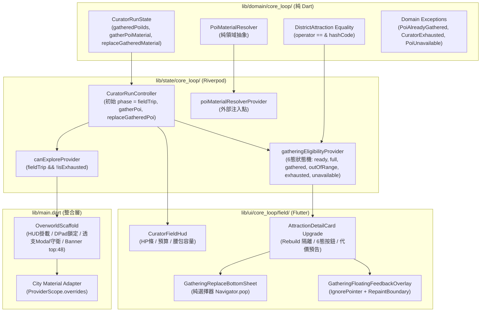
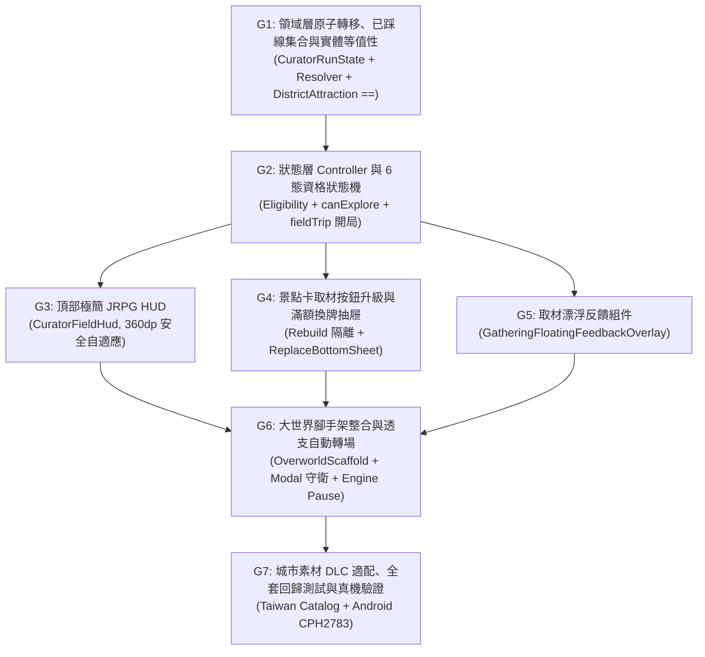

# PLAN — 《Share Tour：奇葩旅行策展人》Milestone M3：大世界 POI 踩線取材與探索接線

- 狀態：**正式簽核通過 (v2 - Formal Approval)** — 經主任架構師與首席前端工程師聯合簽核核准，納入開局 Phase 解鎖、DistrictAttraction 等值性、6 態資格狀態機、Modal 守衛與 360dp 邊距防護
- 流程位置：`spec (通過) → 覆核 (通過) → plan (通過) → 覆核 (通過) → 執行計劃 (TDD) → 覆核`
- 上位文件：`SPEC_MVP_POI_GATHERING.md` (v2)、`CROSS_CUTTING_CONSTRAINTS.md`、`CLAUDE.md`

---

## 1. 架構原則與分層拓撲 (Architecture & Layering Topology)

本里程碑貫徹 Clean Architecture 與專案規範：
- **`domain/`（純領域層）**：零 Flutter / Flame 框架相依。
  - 核心狀態機 `CuratorRunState`：不可變欄位 `gatheredPoiIds`、原子轉移方法 `gatherPoiMaterial` 與 `replaceGatheredMaterial`、最後一搏透支截斷。
  - 領域契約 `PoiMaterialResolver`：純 Dart 介面。
  - 實體相等性：`DistrictAttraction` 實作基於 `id` 之 `operator ==` 與 `hashCode`，確保 Riverpod Family 緩存安全。
  - 領域異常：`PoiAlreadyGatheredException`、`CuratorExhaustedException`、`PoiUnavailableException`。
- **`state/`（Riverpod 狀態層）**：依賴 `domain/`。
  - `CuratorRunController`：初始狀態設為 `phase = fieldTrip`，提供取材與換牌門面。
  - `gatheringEligibilityProvider`：6 態資格狀態機（`ready`, `inventoryFull`, `alreadyGathered`, `outOfRange`, `exhausted`, `unavailable`）。
  - `canExploreProvider`：單向探索許可（`phase == fieldTrip && !isExhausted`），杜絕雙向依賴。
- **`ui/`（Flutter 介面層）**：
  - 頂部極簡 JRPG HUD：`CuratorFieldHud`（高 36~40dp，單一外框容器，`Expanded` 血條，等寬字體）。
  - 景點卡按鈕升級：`_AttractionDetailCard` 抽離距離標籤與按鈕子組件，阻隔 120Hz 全量 Rebuild。
  - 腰包滿額換牌抽屜：`GatheringReplaceBottomSheet`（純選擇器，Navigator 回傳 `int? dropIndex` 避免彈窗競態）。
  - 輕量漂浮反饋：`GatheringFloatingFeedbackOverlay`（`IgnorePointer` + `RepaintBoundary`）。
- **`game/` 與組件接線（Integration）**：
  - `OverworldScaffold` 生命週期接線：`addPostFrameCallback`、`_isStudioModalOpen` 門禁旗標、Flame 引擎暫停與安全恢復（`mounted && game.isAttached`）。
  - 調整 `_DistrictDiscoveryBanner` 頂部邊距（`top: 48`），防止與頂部 HUD 碰撞。
  - 城市圖資 DLC 適配器：在 `main.dart` 組合根注入具體城市素材適配器。

---

## 2. 任務拆解與相依拓撲 (Task Breakdown & Dependency Graph)

---

## 3. 各任務施工規格與 TDD 步驟

### 任務 G1：領域層原子轉移、已踩線集合與實體等值性 `[P0]`
- **目標**：完成純領域契約，支援踩線取材原子轉移、腰包滿額換牌、最後一搏透支截斷，並補齊實體相等性。
- **施工內容**：
  1. `lib/domain/location/models/district_attraction.dart`：
     - 實作基於 `id` 之 `operator ==` 與 `hashCode`，確保 Riverpod Family 緩存安全。
  2. `lib/domain/core_loop/models/poi_material_resolver.dart`：宣告抽象介面 `PoiMaterialResolver`。
  3. `lib/domain/core_loop/models/core_loop_exceptions.dart`：新增 `PoiAlreadyGatheredException`、`CuratorExhaustedException`、`PoiUnavailableException`。
  4. `lib/domain/core_loop/run/curator_run_state.dart`：
     - 新增不可變欄位 `final Set<String> gatheredPoiIds;`（預設為空集合）。
     - 實作 `CuratorRunState gatherPoiMaterial({required String poiId, required TravelMaterial material})`：
       - 防刷檢查：若 `gatheredPoiIds.contains(poiId)` 拋出 `PoiAlreadyGatheredException`。
       - 體力檢查：若 `resources.isExhausted` 拋出 `CuratorExhaustedException`。
       - 容量檢查：若 `inventory.isFull` 拋出 `InventoryFullException`。
       - 計算 $\Delta\text{HP} = 10 + \text{material.riskLevel} \times 2$。
       - 扣減 HP（若 $\le 0$ 截斷為 0，`isExhausted = true`，`phase = CuratorRunPhase.nightEditing`）。
       - 扣減 Budget（允許赤字）。
       - 加入腰包並記錄 `gatheredPoiIds`。
     - 實作 `CuratorRunState replaceGatheredMaterial({required String poiId, required int dropIndex, required TravelMaterial newMaterial})`：
       - 執行相同的防刷、體力、消耗扣減，以 `inventory.replace(dropIndex, newMaterial)` 替換指定素材。
- **測試驗證**：
  - `test/domain/core_loop/poi_gathering_domain_test.dart`
  - 驗證 AC-M3-3.1（消耗與入袋）、AC-M3-3.2（赤字）、AC-M3-3.3（最後一搏透支）、AC-M3-4.2（滿額拋異常）、AC-M3-4.3（換牌成功）、AC-M3-5.1~5.3（防刷與重置）。

---

### 任務 G2：狀態層 Controller 擴充與 6 態資格狀態機 `[P0]`
- **目標**：透過 Riverpod 提供單一狀態寫入門面與高效 Selector，確保開局進入踩線階段。
- **施工內容**：
  1. `lib/state/core_loop/curator_run_controller.dart`：
     - 開局初始狀態設定為 `CuratorRunPhase.fieldTrip`，確保方向鍵解鎖。
     - 實作 `gatherPoi(String poiId)` 與 `replaceGatheredPoi(String poiId, int dropIndex)`：先透過 `PoiMaterialResolver` 取得素材，若為 `null` 拋出 `PoiUnavailableException`。
  2. `lib/state/core_loop/curator_run_providers.dart`：
     - 新增 `poiMaterialResolverProvider = Provider<PoiMaterialResolver>(...)` 注入點。
     - 新增 `canExploreProvider = Provider<bool>(...)`：判斷 `state.phase == CuratorRunPhase.fieldTrip && !state.resources.isExhausted`。
     - 新增枚舉 `GatheringEligibility`（`ready`, `inventoryFull`, `alreadyGathered`, `outOfRange`, `exhausted`, `unavailable`）。
     - 新增 `attractionEligibilityProvider(DistrictAttraction attraction)`：
       - 若 resolver 解析為 `null` $\rightarrow$ `unavailable`。
       - 若與小人直線公尺距離 $> 50$m $\rightarrow$ `outOfRange`。
       - 若已在 `gatheredPoiIds` $\rightarrow$ `alreadyGathered`。
       - 若 `isExhausted` $\rightarrow$ `exhausted`。
       - 若 `inventory.isFull` $\rightarrow$ `inventoryFull`。
       - 否則 $\rightarrow$ `ready`。
- **測試驗證**：
  - `test/state/core_loop/poi_gathering_controller_test.dart`
  - 驗證 AC-M3-1.1、AC-M3-1.2、AC-M3-2.1~2.3、AC-M3-6.1、AC-M3-7.2。

---

### 任務 G3：頂部極簡 JRPG HUD（`CuratorFieldHud`） `[P0]`
- **目標**：構建符合 360dp 螢幕、高 36~40dp 的大世界生存指標面板。
- **施工內容**：
  1. `lib/ui/core_loop/field/curator_field_hud.dart`：
     - 單一整體黑框容器（避免多容器造成 RenderFlex overflow）。
     - 水平排列：`[❤️ HP條]`（使用 `Expanded` 自適應）、`[💰 預算]`、`[👝 腰包容量]`。
     - 數字啟用 `FontFeature.tabularFigures()` 防止走動跳字抖動。
     - 血條具備三色過渡（綠 $>50$、黃 $20\sim50$、紅 $<20$）。
     - 預算為負數時呈現警示紅字。
- **測試驗證**：
  - `test/ui/core_loop/curator_field_hud_test.dart`
  - 驗證 AC-M3-1.1 初始渲染、HP 扣減即時變色、預算赤字樣式、360dp 寬度無 overflow。

---

### 任務 G4：景點卡取材升級與腰包換牌抽屜 `[P0]`
- **目標**：在 `_AttractionDetailCard` 整合 6 態按鈕與代價預覽，隔離 120Hz 重繪，並提供腰包換牌抽屜。
- **施工內容**：
  1. 升級 `_AttractionDetailCard`：
     - 將「距離文字」與「取材按鈕」抽離為獨立 ConsumerWidget，隔離玩家走動時的高頻全量 Rebuild。
     - 依 `GatheringEligibility` 動態呈現按鈕樣式與文案（含 `unavailable` 態）。
     - 顯示預估代價標籤（`⚡-14 HP  💰¥500`）。
     - 若命中當前旅行哲學標籤，顯示 `🎯 契合當前哲學`。
  2. `lib/ui/core_loop/field/gathering_replace_bottom_sheet.dart`：
     - 純選擇器模式：點選舊卡執行 `Navigator.of(context).pop(selectedIndex)`。
     - 關閉後再由上層呼叫 Controller 換牌，杜絕彈窗與透支轉場衝突。
- **測試驗證**：
  - `test/ui/core_loop/attraction_gathering_ui_test.dart`
  - 驗證 AC-M3-2.1~2.3 按鈕狀態切換、AC-M3-4.1~4.3 換牌抽屜互動。

---

### 任務 G5：取材視覺反饋組件（`GatheringFloatingFeedbackOverlay`） `[P1]`
- **目標**：提供具備 JRPG 街機感之浮動文字反饋。
- **施工內容**：
  1. `lib/ui/core_loop/field/gathering_floating_feedback_overlay.dart`：
     - 根節點配置 `IgnorePointer(ignoring: true, child: RepaintBoundary(...))`。
     - 觸發 1.2 秒飄字動畫：紅色 `-XX HP` 與金色 `+ 👝 [素材名]`（Spotlight 附加爆擊標記）。
     - 按鈕在點擊後進入非同步 Debounce 態防刷連點。
- **測試驗證**：
  - `test/ui/core_loop/gathering_floating_feedback_test.dart`
  - 驗證動畫啟動、文字內容與自動消失。

---

### 任務 G6：大世界腳手架整合與透支自動轉場 `[P0]`
- **目標**：在 `lib/main.dart` 完成組裝，實現探索鎖定、透支強制返程與 Flame 引擎守護。
- **施工內容**：
  1. `OverworldScaffold` 頂部掛載 `CuratorFieldHud`。
  2. 調整 `_DistrictDiscoveryBanner` 邊距為 `top: 48`，避開頂部 HUD。
  3. `_RetroHudOverlay` 降級為 Debug 模式下可收折按鈕。
  4. `_DPadOverlay` 監聽 `canExploreProvider`：當為 `false` 時反灰並忽略點擊。
  5. 監聽 `curatorRunControllerProvider`：
     - 維護 `_isStudioModalOpen` 門禁旗標。
     - 當 `isExhausted` 觸發且尚未開啟 Modal 時，使用 `WidgetsBinding.instance.addPostFrameCallback`：
       - 清空選中景點（`selectedAttraction.value = null`）。
       - 標記 `_isStudioModalOpen = true`。
       - `game.pauseEngine()` ➔ `await showModalBottomSheet(CuratorStudioModal)` ➔ `finally { _isStudioModalOpen = false; if (mounted && game.isAttached) game.resumeEngine(); }`。
- **測試驗證**：
  - `test/ui/core_loop/overworld_curator_integration_test.dart`
  - 驗證 AC-M3-6.1、AC-M3-6.2。

---

### 任務 G7：城市素材 DLC 適配、全套回歸測試與真機驗證 `[P0]`
- **目標**：提供台灣景點特色素材庫，跑通全倉測試與實體機驗證。
- **施工內容**：
  1. `lib/data/core_loop/taiwan_attraction_materials.dart`：
     - 為台北101、故宮、陽明山、九份、高美濕地等名所建立專屬 `TravelMaterial`。
     - 實作 `TaiwanPoiMaterialResolver`（專屬卡優先，Category 通用池 fallback）。
  2. 在 `lib/main.dart` 透過 `ProviderScope.overrides` 注入。
  3. 執行 `flutter test`（全倉 300+ 測試零失敗）。
  4. 執行 `flutter analyze`（0 issues）。
  5. 構建並部署至實體 Android 手機（CPH2783），進行實機真機走動與取材截圖驗證。
- **測試驗證**：
  - `test/architecture/layer_boundaries_test.dart`（AC-M3-7.1 通過，通用層零 city 硬編碼）。

---

## 4. 驗收條件 (AC) 映射矩陣

| 驗收條件 (AC) | 負責任務 | 驗證測試檔案 |
|---|---|---|
| **AC-M3-1.1 ~ 1.2**（HUD 初始狀態與距離更新） | G2, G3 | `poi_gathering_controller_test.dart`, `curator_field_hud_test.dart` |
| **AC-M3-2.1 ~ 2.3**（6 態資格與距離邊界） | G2, G4 | `poi_gathering_controller_test.dart`, `attraction_gathering_ui_test.dart` |
| **AC-M3-3.1 ~ 3.3**（取材消耗、赤字與最後一搏） | G1, G2 | `poi_gathering_domain_test.dart` |
| **AC-M3-4.1 ~ 4.3**（腰包滿額換牌與捨棄） | G1, G4 | `poi_gathering_domain_test.dart`, `attraction_gathering_ui_test.dart` |
| **AC-M3-5.1 ~ 5.3**（單局防刷冷卻與重置） | G1, G2 | `poi_gathering_domain_test.dart` |
| **AC-M3-6.1 ~ 6.2**（體力透支、輸入鎖定與自動彈窗） | G1, G6 | `poi_gathering_domain_test.dart`, `overworld_curator_integration_test.dart` |
| **AC-M3-7.1 ~ 7.2**（架構隔離與純記憶體秒級測試） | G1, G7 | `layer_boundaries_test.dart`, 全套單元測試 |
