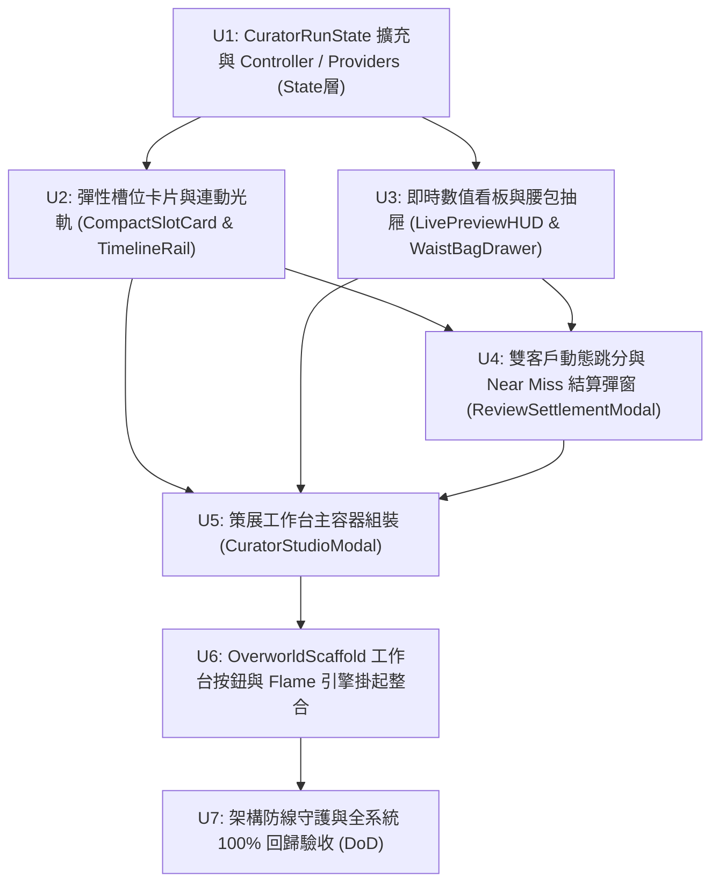

# 《Share Tour：奇葩旅行策展人》Milestone M2 實作計劃
# 4 槽位時間線編輯器 UI、雙客戶動態評審彈窗與狀態接線 (Plan v2 - 覆核修訂正式版)

---

## 1. 架構分層與目錄結構 (Architecture & Structure)

嚴格貫徹 Clean Architecture、Riverpod 細粒度派生監聽與「城市即實體 DLC」解耦原則：

```text
lib/
├── domain/core_loop/                     # (M1 已完成，純領域核心，0 依賴)
│   └── run/curator_run_state.dart        # 擴充 initial 工廠與 tweakItinerary
├── data/core_loop/                       # (M1 已完成，京都夜間 32 處 DLC 素材庫)
├── state/
│   └── core_loop/
│       ├── curator_run_controller.dart   # Riverpod Notifier 單局狀態機控制器
│       └── curator_run_providers.dart    # DLC 素材池抽象注入與衍生 ItineraryStats Provider
└── ui/
    └── core_loop/
        ├── curator_studio_modal.dart     # 工作台主容器 (ModalBottomSheet，90% 螢幕高度)
        ├── review_settlement_modal.dart  # 雙客戶動態審查跳分與 Near Miss 結算彈窗
        └── components/
            ├── timeline_rail.dart        # 四幕劇連動光軌 (Synergy Rail，+20% Combo / 💀 拉車疲勞)
            ├── compact_slot_card.dart    # 彈性自適應槽位卡 (Expanded，晨曦/晴空/黃昏/月夜)
            ├── live_preview_hud.dart     # 即時數值看板 (開銷對比預算、熱度、主題、呈送按鈕)
            └── waist_bag_drawer.dart     # 腰包抽屜 (卡片細粒度引用狀態、決定性抽卡按鈕)

test/
├── state/
│   └── core_loop/
│       └── curator_run_controller_test.dart  # 狀態機生命週期測試 (AC-UI-1.1 ~ 1.8)
├── ui/
│   └── core_loop/
│       ├── timeline_editor_widget_test.dart  # 4 槽位編輯器 Widget 測試 (AC-UI-2.1 ~ 2.5)
│       └── review_settlement_widget_test.dart # 審查彈窗跳分與微調 Widget 測試 (AC-UI-3.1 ~ 3.5)
└── architecture/
    └── layer_boundaries_test.dart            # 架構防線守護（確保 state/ 0 具名城市污染）
```

---

## 2. 任務拆解與執行拓撲 (Task Breakdown & Topology)



| 任務 | 內容與契約對應 | 產出檔案 | 對應 AC (合計 18 條) |
|---|---|---|---|
| **U1** | **狀態機控制器與 City-as-DLC 素材池抽象**<br>擴充 `CuratorRunState` 支援 `philosophizing` 初始工廠與 `tweakItinerary`。<br>實作 `curatorMaterialPoolProvider`（抽象素材池，守護 `layer_boundaries_test.dart`）與 `itineraryStatsProvider`（Memoized 衍生快取）。<br>實作 `CuratorRunController`（常駐 Notifier），支援選哲學、槽位引用（禁止重複）、槽位互換（支援空槽）、決定性抽卡、審查結算、Near Miss 微調與新局重置。 | `lib/domain/core_loop/run/curator_run_state.dart`<br>`lib/state/core_loop/curator_run_controller.dart`<br>`lib/state/core_loop/curator_run_providers.dart` | **AC-UI-1.1 ~ 1.8** (8) |
| **U2** | **彈性槽位卡片與頂部連動光軌**<br>實作 `CompactSlotCard`（`Expanded` 自適應 76~95dp，晨曦柔橙、晴空蔚藍、黃昏紫金動態相機倍率、月夜深藍），與 `TimelineRail`（金色連鎖光軌 `Key('combo_indicator_0_1')` + `+20% Combo`、紅色疲勞警示 `Key('fatigue_warning_1_2')` + `💀 拉車疲勞`）。 | `lib/ui/core_loop/components/compact_slot_card.dart`<br>`lib/ui/core_loop/components/timeline_rail.dart` | **AC-UI-2.1 ~ 2.4** (4) |
| **U3** | **即時數值看板與腰包卡片抽屜**<br>實作 `LivePreviewHUD`（客群視角切換、開銷對比預算、熱度、主題、呈送按鈕禁用/啟用），與 `WaistBagDrawer`（家族 Selector 監聽入槽狀態打上「已排入 Slot X」遮罩，`Key('draw_sample_material_button')` 決定性抽卡）。 | `lib/ui/core_loop/components/live_preview_hud.dart`<br>`lib/ui/core_loop/components/waist_bag_drawer.dart` | **AC-UI-2.5**, 部分 AC-UI-1.3 |
| **U4** | **雙客戶動態跳分與 Near Miss 結算彈窗**<br>實作 `ReviewSettlementModal`（支援單獨注入 fixture 測試），包含社畜 vs 網紅切換、分步跳分動態呈現、`Key('stamp_near_miss')` 蓋印、`Key('btn_tweak_itinerary')` 返回微調行程、`Key('btn_restart_run')` 重開新局、`Key('btn_collect_rewards')` 收下佣金。 | `lib/ui/core_loop/review_settlement_modal.dart` | **AC-UI-3.1 ~ 3.5** (5) |
| **U5** | **策展工作台主容器組件**<br>整合 U2、U3 與 U4 為 `CuratorStudioModal`（ModalBottomSheet，90% 螢幕高度），固定頂部光軌+槽位+看板，底部腰包滾動隔離，包裹 `RepaintBoundary`。 | `lib/ui/core_loop/curator_studio_modal.dart` | 整合驗收 |
| **U6** | **主畫面整合與 Flame 引擎安全掛起**<br>在 `OverworldScaffold` 右下角加入 `📑 策展工作台` 按鈕（48x48 dp，排在 `_ModeToggle` 上方）。開啟工作台時呼叫 `game.pauseEngine()`，`try-finally` 關閉時若 `game.isAttached` 呼叫 `game.resumeEngine()`。在 `main.dart` 注入京都夜間 DLC 素材池。 | `lib/main.dart` | 系統整合 |
| **U7** | **架構防線守護與全系統 100% 回歸**<br>執行 `layer_boundaries_test.dart`（確保 `state/` 與 `domain/` 零具名城市污染與零框架依賴），執行全套單元/Widget 測試與 `flutter analyze` 達成 0 錯誤 0 警告。 | `test/architecture/layer_boundaries_test.dart` | 全系統驗收 (18/18 AC) |

---

## 3. 前端效能與人體工學規範 (120Hz Zero-Latency Guidelines)

1. **細粒度派生監聽 (Selective Listening & Memoization)**：
   - 數值看板與光軌直接監聽 `itineraryStatsProvider`（享有 Riverpod Memoization，避免重複運算）。
   - 腰包卡片項目採用家族 Selector `ref.watch(curatorRunControllerProvider.select((s) => s.itinerary.slots.indexWhere((slot) => slot?.id == material.id)))`，僅入槽狀態變更之卡片重繪，其餘 30+ 張卡片零 Rebuild。
2. **直螢幕 360dp 極限排版防護**：
   - 4 槽位橫向容器採用 `Row(children: [ Expanded(...), ... ])` 彈性自適應，間距固定為 4dp，文字全部配置 `maxLines: 1` 與 `ellipsis`。
3. **無手勢穿透與省電保護**：
   - `showModalBottomSheet` 自帶 `ModalBarrier` 阻斷向下的 HitTest，徹底杜絕 DPad 誤觸。
   - `try-finally` 守護 `game.pauseEngine()` 與 `game.resumeEngine()`。

---

## 4. 驗收標準 (Definition of Done)

1. **功能完整度**：18 條 AC（AC-UI-1.1 ~ 1.8、AC-UI-2.1 ~ 2.5、AC-UI-3.1 ~ 3.5）單元與 Widget 測試全數綠燈。
2. **架構健全度**：
   - `lib/domain/core_loop/` 維持 100% 純 Dart，無任何 Flutter/Flame 引用。
   - `lib/state/` 零 `kyoto` / `taiwan` 具名城市字樣與 import，`layer_boundaries_test.dart` 綠燈通過。
3. **代碼品質**：`flutter analyze` 保持 0 errors, 0 warnings, 0 lints。
4. **體驗手感**：直螢幕 360dp 佈局無任何 RenderFlex Overflow，調換素材時 120Hz 零微掉幀。
