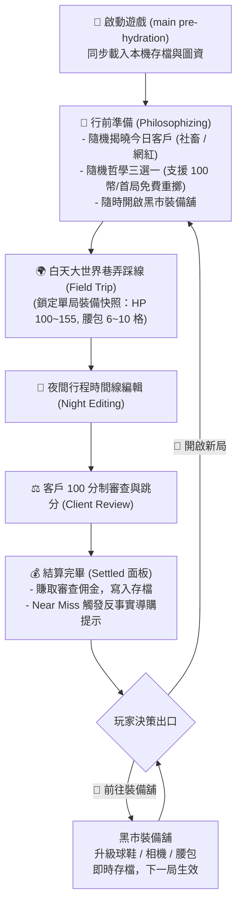

# Milestone M4 規格文件：阿導行前委託、黑市裝備升級與本機存檔 (SPEC_MVP_META_PROGRESSION)

> **版本**：v2 (專家三方會審修訂簽核版)  
> **關聯里程碑**：Milestone M4 (方案 A)  
> **目標**：實現行前委託與哲學抽取儀式、黑市裝備升級系統、以及本機存檔持久化，補齊 Roguelite「開局 ➔ 踩線 ➔ 排程 ➔ 審查 ➔ 獲利 ➔ 局外升級 ➔ 再來一局」的完整閉環。  
> **架構守則**：嚴格遵守 Clean Architecture、純 Dart 領域隔離；存檔依據 CLAUDE.md 核准抽象採用 `PersistenceRepository`，資料模型落實 CC-1 (UUID)、CC-2 (UTC 時間) 與 CC-3 相容性路徑。

---

## 1. 使用者旅程與核心心流 (User Journey & Core Flow)



---

## 2. 功能需求與行為契約 (Requirements & Behavior Contracts)

### REQ-M4-01 行前委託與哲學抽取儀式 (`philosophizing`) `[P0]`
1. **觸發時機**：
   - 首次進入遊戲，或玩家在結算完畢/大世界點擊「開啟新局 / 再來一局 (Restart Run)」時，單局流程推進至 `CuratorRunPhase.philosophizing`。
2. **客戶委託隨機揭曉 (Client Briefing)**：
   - 系統依機率隨機揭曉本局委託客戶（`budgetWorker` 社畜 或 `hypeInfluencer` 網紅）。
   - 展示客戶身分、預算上限（社畜 ¥2,000 / 網紅 ¥10,000）、通關偏好與特殊雷點警示。
   - **佣金數值平衡調整**：
     - 社畜：Pass = 1,000 幣，Perfect = 1,500 幣，Near Miss = 300 幣。
     - 網紅：Pass = 1,500 幣，Perfect = 2,250 幣，Near Miss = 450 幣。
3. **旅行哲學三選一與靈感重擲 (Philosophy Selection & Reroll)**：
   - 系統自 5 大旅行哲學池（`midnight`, `slow`, `gourmet`, `antiTourism`, `chaos`）中不重複隨機抽取 **3 張候選卡**（`philosophyChoices`）。
   - 支援決定性種子注入（供 TDD 純單元測試驗證確定性組合）。
   - **靈感重擲機制（長期金幣槽 Coin Sink）**：
     - 提供「🎲 換一批哲學」按鈕。
     - 每局首次遊玩若為 0 幣，提供 **1 次免費重擲**。
     - 隨後每次重擲消耗 **100 佣金幣**（餘額不足時禁用）。
   - 玩家點選一張哲學卡設為 `selectedPhilosophy`；**未選定前調用 `departToFieldTrip()` 嚴格拋出 `PreconditionFailedException`**。
4. **推進至踩線階段與單局快照 (Run Equipment Snapshot)**：
   - 玩家選定哲學後點擊「出發踩線！」，狀態原子轉移至 `CuratorRunPhase.fieldTrip`。
   - **單局裝備快照鎖定**：系統對局外裝備進行單局快照（`equipmentSnapshot`），單局內所有數值（HP 上限、黃昏相機倍率、腰包容量）均以此快照為準，不受中途黑市升級影響，徹底杜絕利用微調行程逆向刷錢。
   - 新局資源依快照裝備等級初始化：
     - HP 上限由球鞋等級決定（Lv.1: 100, Lv.2: 125, Lv.3: 155）。
     - 腰包容量由腰包等級決定（Lv.1: 6, Lv.2: 8, Lv.3: 10）。
     - 預算依客戶給定，Theme 重置為 50，`gatheredPoiIds` 清空。

---

### REQ-M4-02 黑市裝備舖系統 (Black Market Gear Shop) `[P0]`
1. **入口配置**：
   - 可在「行前準備畫面」或「審查結算 (Settled) 畫面」隨時呼叫「🛒 黑市裝備舖」。
2. **三大核心裝備數值與平滑階梯（覆蓋首局 Near Miss 體驗）**：
   - **👟 慢跑球鞋 (Sneakers)**：
     - Lv.1: 最大 HP 100（初始）
     - Lv.2: 最大 HP 125（升級花費 **300 金幣** — 首局 Near Miss 300 幣剛好買得起！）
     - Lv.3: 最大 HP 155（升級花費 **1200 金幣** — 覆蓋 10 件素材採集體力需求，MAX 徽章）
   - **📸 復古相機 (Camera)**：
     - Lv.1: 黃昏高潮槽位 Hype 倍率 1.5x（初始）
     - Lv.2: 黃昏高潮槽位 Hype 倍率 1.8x（升級花費 **300 金幣**）
     - Lv.3: 黃昏高潮槽位 Hype 倍率 2.2x（升級花費 **1200 金幣**，MAX 徽章）
   - **👝 多功能腰包 (Waist Bag)**：
     - Lv.1: 素材收納容量 6 格（初始）
     - Lv.2: 素材收納容量 8 格（升級花費 **300 金幣**）
     - Lv.3: 素材收納容量 10 格（升級花費 **1200 金幣**，MAX 徽章）
3. **升級消費行為契約**：
   - 若當前金幣 $\ge$ 升級花費，扣除金幣，裝備等級 +1，立即寫入存檔；介面標註「升級成功！效果於下一局生效」。
   - 若當前金幣 $<$ 升級花費，按鈕呈灰階禁用態，點擊提示「金幣不足」。
   - 若裝備已達 Lv.3，按鈕呈金色「MAX」徽章禁用態，不可再升級。

---

### REQ-M4-03 存檔持久化契約 (`PersistenceRepository`) `[P0]`
1. **抽象解耦規範（CLAUDE.md 核准抽象之二）**：
   - 存檔功能定義為純領域介面 `PersistenceRepository`，通用層零框架依賴。
   ```dart
   abstract class PersistenceRepository {
     Future<CuratorSaveData?> loadSave();
     Future<void> save(CuratorSaveData data);
     Future<void> clearSave();
   }
   ```
2. **存檔資料模型 (`CuratorSaveData`)**：
   - `profileId`: 存檔身分 UUID（符合 CC-1）。
   - `saveVersion`: 存檔格式版本號（整數，首版為 1）。
   - `lastMonotonicSeq`: 單調事件序號（保留 CC-3 事件重播相容演進點）。
   - `coins`: 累積佣金幣（整數，$\ge 0$）。
   - `sneakersLevel`: 球鞋等級（1~3）。
   - `cameraLevel`: 相機等級（1~3）。
   - `waistBagLevel`: 腰包等級（1~3）。
   - `completedRuns`: 累計通關局數（整數，$\ge 0$）。
   - `updatedAtUtc`: 最後存檔時間戳（符合 CC-2，UTC ISO8601）。
3. **自動存檔觸發點**：
   - 審查結算完成獲得佣金時（`completeReview`）。
   - 於黑市裝備舖成功升級任一裝備時（`upgradeEquipment`）。
   - 執行靈感重擲花費金幣時（`rerollPhilosophies`）。
4. **冷啟動同步水合與損毀安全防護 (Pre-Hydration & Safe Degradation)**：
   - 存檔於 `main()` 中在 `runApp()` 前與圖資同步平行預載入（`< 50ms`），首幀即具備正確數值，徹底杜絕無存檔數值閃跳（FOUC）。
   - 若本機尚無存檔，自動建立預設初始存檔（全 Lv.1，0 金幣，UUID）。
   - 存檔若損毀，自動將損毀檔備份至 `save_corrupted_<timestamp>.bak`，並優雅降級為初始狀態，嚴禁靜默覆寫滅失。

---

### REQ-M4-04 視覺反饋與人體工學 (Game Feel & UI) `[P1]`
1. **行前準備介面 (Briefing Modal)**：
   - 滿版底抽屜，背景深色半透明遮罩阻斷 Flame 與大地圖。
   - **360dp 防破版排版防護**：3 張哲學卡採**垂直卡牌單選清單（Vertical Selectable Cards）**，每張卡寬度 100%，嚴禁靜態 3 欄並排。
   - 頂部展示今日客戶立繪頭像、預算與偏好標籤；選中哲學卡具備金色邊框與高亮。
2. **黑市裝備舖介面 (Gear Shop Modal)**：
   - 街機復古金幣計數看板（`🪙 金幣: 1,200`），數字變動時具備微縮放跳字動畫。
   - 3 張裝備卡垂直排列，清楚標註數值變更（`HP 100 ➔ 125`、`容量 6 ➔ 8`）。
   - 觸控區域嚴格符合 $\ge 48\times 48$ dp 規範。
3. **結算出口與近失導購提示 (Settled Flow & Counterfactual Feedback)**：
   - 結算彈窗在點擊「💰 收下佣金」後，**不可直接關閉鎖死大地圖**，原地切換為結算摘要面板，提供兩大醒目按鈕：
     - `[🛒 黑市裝備舖]`（前往強化裝備）
     - `[🔄 再來一局]`（直接喚起行前準備）
   - 若為 Near Miss（差 1~10 分），結算評語注入反事實導購提示：
     - *網紅差分*：「要是黃昏絕景再震撼一點就好了...（📸 相機目前 Lv.1，升至 Lv.2 可提升黃昏加成！）」
     - *社畜超支*：「路上體力不支花錢搭車...（👟 球鞋升至 Lv.2 可增加 25 點體力！）」

---

## 3. 驗收條件 (Acceptance Criteria)

### AC-M4-1 領域層：行前準備與哲學抽取
- **AC-M4-1.1**：進入 `philosophizing` 階段時，系統生成隨機客戶委託，且 `philosophyChoices` 精確包含 3 張不重複之 `TravelPhilosophy`。
- **AC-M4-1.2**：未選擇任何哲學（`selectedPhilosophy == null`）時，調用 `departToFieldTrip()` 拋出 `PreconditionFailedException`，狀態無變更。
- **AC-M4-1.3**：選定哲學後調用 `departToFieldTrip()`，狀態原子轉移至 `CuratorRunPhase.fieldTrip`，`philosophy` 為玩家選定項，並鎖定 `equipmentSnapshot`。
- **AC-M4-1.4**：出發後阿導初始 HP 上限精確等於快照球鞋等級之 `maxHp`（100 / 125 / 155），腰包容量精確等於腰包等級之 `capacity`（6 / 8 / 10）。
- **AC-M4-1.5**：靈感重擲契約：首次為 0 幣時調用 `rerollPhilosophies()` 成功換出 3 張新卡且不扣幣；後續調用扣除 100 幣；餘額不足時調用拋出 `InsufficientCoinsException`。

### AC-M4-2 領域層：黑市裝備升級契約
- **AC-M4-2.1**：玩家持有 350 金幣時升級球鞋 Lv.1（需 300 金幣），操作成功，金幣扣減為 50，球鞋等級變更為 Lv.2，最大 HP 變更為 125。
- **AC-M4-2.2**：玩家持有 200 金幣時嘗試升級相機 Lv.1（需 300 金幣），操作拋出 `InsufficientCoinsException`，金幣與等級零副作用。
- **AC-M4-2.3**：任一裝備達到 Lv.3 時，`nextUpgradeCost` 為 `null`，再次嘗試升級拋出 `MaxLevelReachedException`，金幣零副作用。
- **AC-M4-2.4**：單局快照防刷：單局進行中（`fieldTrip` 或 `nightEditing`）在黑市升級裝備，單局內的即時計算（HP/倍率/容量）維持原開局快照，新等級存入局外存檔於下局生效。

### AC-M4-3 領域層：存檔持久化與決定性重載
- **AC-M4-3.1**：完成審查結算獲得佣金幣後，`PersistenceRepository.save` 被呼叫，儲存之 `coins` 精確增加該筆佣金。
- **AC-M4-3.2**：在球鞋 Lv.2、相機 Lv.1、金幣 1200 狀態下觸發存檔，重新執行 `loadSave` 能 100% 完整還原相應金幣與裝備等級。
- **AC-M4-3.3**：空存檔環境下呼叫 `loadSave`，回傳預設初始存檔（0 金幣，全 Lv.1，UUID 符合 CC-1）。
- **AC-M4-3.4**：架構邊界測試：`PersistenceRepository` 介面不得引用 Flutter/Flame 型別，使用 `FakePersistenceRepository` 可在純 `dart test` 環境下秒級跑完整套測試。

### AC-M4-4 UI / Widget 整合驗收
- **AC-M4-4.1**：在 360dp 手機螢幕寬度下，行前準備（垂直哲學清單）與黑市裝備舖介面零 `RenderFlex overflowed` 報錯。
- **AC-M4-4.2**：裝備舖升級按鈕於金幣不足時呈灰階禁觸態，點擊無異常。
- **AC-M4-4.3**：通關結算後（`settled`），介面常駐提供「🛒 前往裝備舖」與「🔄 再來一局」兩大按鈕，禁止玩家被留在鎖定的大地圖上。
- **AC-M4-4.4**：Flame 引擎暫停引用計數配對：開啟 `BriefingModal` 或 `GearShopModal` 時 Flame 暫停，全部關閉返回地圖後 Flame 正確恢復。
