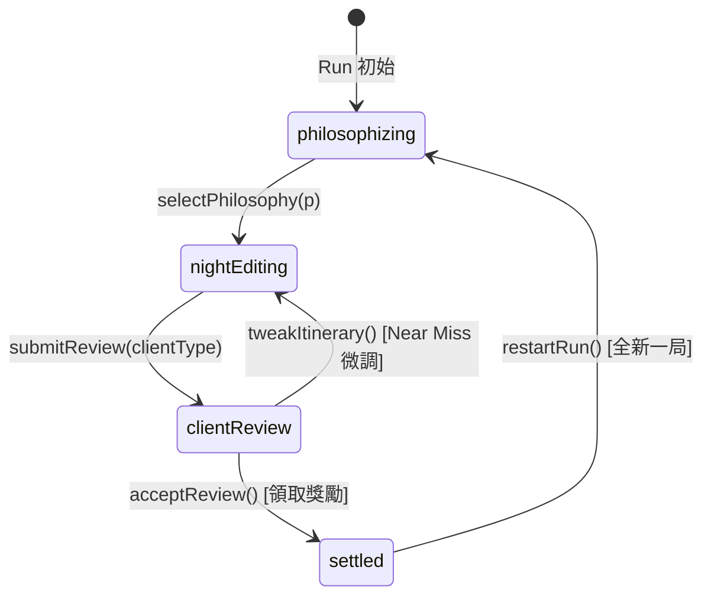

# 《Share Tour：奇葩旅行策展人》Milestone M2 規格書
# 4 槽位時間線編輯器 UI、雙客戶動態評審彈窗與狀態接線 (Spec v2 - 覆核修訂正式版)

---

## 1. 業務背景與目標 (Background & Goals)

### 1.1 階段定位
在 Milestone M1 中，我們已完成了純領域層（Domain Layer）的核心規則、數值計算流水線（黃昏相機倍率、相鄰標籤連鎖 +20%、拉車疲勞負面衝突）以及雙客戶 100 分制審查引擎。
**Milestone M2 的唯一任務：將 M1 的領域核心透過 Riverpod 狀態層與 Flutter UI 完整接線，使玩家在手機上可以直接進行「選素材、排時間線、實時預覽、客戶審查、結算跳分、返回微調 / 🔄 再來一局」的完整閉環互動體驗。**

### 1.2 體驗核心指標
1. **即時決策回饋（Zero-Latency Preview）**：玩家在調換時段素材時，看板與光軌必須同步重算並呈現變化。
   > 原文的「16ms / 120Hz」宣稱已刪除（增修 01 A 節）：widget test 量不到幀率，該宣稱無法驗收。`PLAN_MVP_CAUSAL_FEEDBACK` 已因同一理由刪除同款宣稱，改以「切片訂閱者 rebuild 次數」作為可測的替代。
2. **四幕劇式旅行儀式感（Circadian Rhythm Fantasy）**：時段槽位具備鮮明的天色漸層與旅行節奏（06:00 晨曦散步 ➔ 11:00 午後美食 ➔ 16:00 黃昏絕景相機高潮 ➔ 19:00 深夜怪談收尾），打破冷冰冰的算術表格感。
3. **動態評審跳分與 Near Miss 心流閉環**：評審彈窗逐項揭露客戶反應（超支扣分、絕景打折、反無聊懲罰）；在 60~69 分 Near Miss 時，提供「🔧 返回微調行程（Tweak & Retry）」讓玩家痛快替換超支卡，以及「🔄 放棄並再來一局（New Run）」的重玩心理推力。

---

## 2. 行為契約與功能需求 (Functional Specifications)

### 2.1 狀態層契約：策展單局控制器 (`CuratorRunController`)
提供宣告式狀態管理（`state/core_loop/curator_run_controller.dart`），封裝不可變領域狀態 `CuratorRunState`。在單局進行期間維持常駐（非 autoDispose），避免關閉彈窗時草稿丟失。

1. **哲學選定與初始化**：
   - 初始狀態為 `CuratorRunPhase.philosophizing`，4 槽位皆為 `null`，腰包為空，`canSubmit = false`。
   - 呼叫 `selectPhilosophy(TravelPhilosophy)`：鎖定當局哲學，狀態推進至 `CuratorRunPhase.nightEditing`。
2. **素材庫存與所有權模型（Reference with In-Use State）**：
   - **腰包持有，槽位引用**：腰包始終持有阿導收集到的所有素材；時間線槽位僅持有對素材的引用。
   - **禁止重複入槽**：同一素材實體（相同 `id`）禁止同時被放入多個槽位（防刷分）。若嘗試放入已在其他槽位的素材，自動執行交換（Swap）。
   - **決定性測試抽卡**：提供 `drawSampleMaterial({Random? random})` 與 `drawMaterialById(String id)`，支援注入隨機種子以滿足 CC-3 決定性重播測試，由圖資 DLC 提供預設素材庫（如京都素材）。
3. **4 槽位時間線編排**：
   - 槽位索引固定為 0（清晨）、1（午後）、2（黃昏）、3（深夜）。
   - `placeMaterialInSlot(int slotIndex, TravelMaterial material)`：將素材置入指定槽位。
   - `removeMaterialFromSlot(int slotIndex)`：清空該槽位（退回非使用狀態），無需擔心腰包溢出。
   - `swapSlots(int fromIndex, int toIndex)`：支援任意兩槽位互換（包含其中一槽位為空的情況，即槽位移動），受 `0 <= index < 4` 嚴格邊界保護。兩索引相同時為決定性 No-op。
   - 槽位變更時，控制器自動同步呼叫領域流水線 `TimelineItinerary.calculateStats` 更新 `currentStats`（Cost, Hype, Theme, Fatigue, Combos）。
   - ~~當且僅當 4 個槽位皆非空時，標記 `canSubmit = true`。~~ **已由 `SPEC_MVP_AMENDMENT_01` 的 `AC-A1-3.7/3.8` 取代**：可提交槽位數為 3 或 4，且已填槽位必須連續佔用。現況實作見 `live_preview_hud.dart:171-172`。
4. **目標客戶審查基準**：
   - 單局支援指定目標審查視角（`ClientType.budgetWorker` 極限窮遊社畜 vs `ClientType.hypeInfluencer` IG 網紅）。
   - 即時看板依據當前視角切換預算上限（2000 円 vs 8000 円）與超支預警。
5. **客戶審查呈送與結算發放**：
   - 呼叫 `submitReview(ClientType clientType)`：產生確定性結算報告 `ReviewReport`，推進至 `clientReview`。
   - 呼叫 `acceptReview()`：將賺得的佣金累積至 `state.equipment.coins`（局外資產 `EquipmentInventory.coins`），推進至 `settled`。
6. **Near Miss 返回微調與再來一局**：
   - **`tweakItinerary()`**：僅在 `clientReview` 階段且評等為 Near Miss 或 Rejected 時可用。關閉審查彈窗，保留當前 4 槽位與腰包，回退至 `nightEditing`，讓玩家更換一張卡再次挑戰！
   - **`restartRun()`**：清空 4 槽位與腰包，重置當局 HP（依球鞋等級恢復滿值）、預算重置，已累積的佣金與裝備等級保持不變，生成全新單局 UUID（符合 CC-1），回退至 `philosophizing`。

---

### 2.2 4 槽位時間線編輯器介面 (`CuratorStudioModal`)

#### A. 容器形式與 Flame 引擎掛起 (ModalBottomSheet + Pause Engine)
- 入口：在主畫面右下方（`ModeToggle` 上方）提供常駐 `📑 策展工作台` 按鈕（最小觸控面積 48x48 dp）。
- 彈出方式：採用 Flutter 原生 `showModalBottomSheet(isScrollControlled: true, useSafeArea: true)`，高度佔螢幕 90%，自帶原生暗化遮罩徹底防止底層 DPad 穿透。
- **引擎掛起**：開啟時自動呼叫 `game.pauseEngine()`，停止大地圖 Canvas 無效渲染以省電降溫；關閉時呼叫 `game.resumeEngine()` 恢復 60fps。

#### B. 頂部四幕劇時間線軌道 (The Circadian Timeline Rail)
針對手機直螢幕（360dp~430dp）進行精確緊湊排版，避免破版：
- **頂部連動光軌 (Synergy Rail)**：
  - 橫跨 4 槽位的細長光軌。相鄰槽位命中同標籤時，該段軌道點亮金色流光並標示 `Key('combo_indicator_0_1')` 與 `+20% Combo`。
  - 相鄰槽位雙高風險（`riskLevel >= 3`）時，該段軌道變為紅色警示並標示 `Key('fatigue_warning_1_2')` 與 `💀 拉車疲勞`。
- **4 時段緊湊槽位卡片 (Compact Slot Cards, 寬約 76~80dp)**：
  - 各槽位擁有獨特天色漸層背景：
    - **Slot 0 [06:00 晨曦]**：晨曦柔橙色，標籤提示 `#散步+5`。
    - **Slot 1 [11:00 午後]**：蔚藍晴空，標籤提示 `#美食+5`。
    - **Slot 2 [16:00 黃昏]**：紫金晚霞，金色高亮圖示 `📷 相機焦點 ×[倍率]`（動態反映當前相機等級：Lv.1 1.5x / Lv.2 1.8x / Lv.3 2.2x）。
    - **Slot 3 [19:00 深夜]**：月夜深藍，提示 `#深夜收尾`。
  - 卡片內容緊湊化：時段圖示、素材縮寫（Truncated Name，最多 5 字 + `...`）、關鍵數值丸（如 `🔥60` / `🎯35`）、風險星級圓點。
  - 支援點擊槽位卸下素材或點擊另一槽位進行互換。

#### C. 中部即時數值看板 (Live Preview HUD)
- **客群視角切換器**：提供 `社畜視角` 與 `網紅視角` 切換按鈕。
- **即時試算指標**：
  - **總開銷 (Cost)**：當前總花費 / 預算上限（社畜 2000 円超支時跳紅字警示）。
  - **預估熱度 (Effective Hype)**：含黃昏相機倍率與連鎖加成之最終熱度。
  - **主題滿意 (Theme)**：當前主題分數（0~100），含哲學加權與疲勞扣分。
- **呈送審查按鈕 (Submit Button)**：
  - 4 槽位未滿時為 Disabled，顯示「請填滿 4 個時段」。
  - 4 槽位填滿時高亮啟用，標記 `Key('submit_itinerary_button')`，點擊彈出審查彈窗。

#### D. 底部阿導腰包素材抽屜 (Waist Bag Drawer)
- 網格/水平滾動展示阿導持有之卡牌。
- 若卡牌已被排入時間線，卡牌上方顯示半透明遮罩並打上「已排入 Slot X」標記，點擊可快速定位。
- 輔助採集按鈕：提供 `[測試] 🎲 採集京都夜間素材` 按鈕（`Key('draw_sample_material_button')`），方便無 GPS 情境下快速抽卡測試。

---

### 2.3 雙客戶審查與結算彈窗 (`ReviewSettlementModal`)

1. **客戶切換與審查預設**：
   - 預設載入當前委託客戶（如社畜），提供切換頁籤 `Key('client_tab_budgetWorker')` 與 `Key('client_tab_hypeInfluencer')`。
2. **動態跳分揭露節奏 (Dramatic Reveal)**（**已依增修 01 A 節改寫為現行公式**）：
   - **社畜小林**（`client_review_engine.dart:26-101`）：
     1. 預算得分：滿分 `100 - themeWeight` = **44**。不超支得滿分；超支扣 `round(超支比例 × overspendPenaltyPoints)`（`overspendPenaltyPoints = 100`），結果 clamp 至 `0~44`。
     2. 主題得分：`round(themeWeight × finalTheme / 100)`，`themeWeight = 56`，最高 **56**。
     3. 反無聊扣分：`totalHype < boredomThreshold` 時固定扣 **25**。`boredomThreshold = targetHype × boredomHypeRatio` = `30 × 560%` = **168**（`client_spec.dart:40,49`）。
     4. 滿意度 = `budgetScore + themeScore − boredomPenalty`，clamp `0~100`。
   - **網紅安娜**（`client_review_engine.dart:103-160`）：
     1. 基礎總爆點：素材總 Hype（含黃昏相機倍率與同標籤共鳴）。
     2. 疲勞懲罰：每組相鄰高風險 `round(targetHype × 14%)` = **21 Hype**。混亂冒險哲學下**反轉為 +21**（`turnsAdjacentHighRiskIntoHypeCombo`，`:114-118`）。
     3. 絕景階梯：`spotlightLadder = [0.70, 0.75, 0.80, 0.85, 1.00]`，依 `spotlightCount` 0~4 取值。**無絕景為 ×0.70，不是打五折；且這是四階階梯，不是二元開關。**
     4. 主題係數：`(themeFloor + (100 − themeFloor) × finalTheme / 100) / 100`，`themeFloor = 44`。
     5. 滿意度 = `effectiveHype / targetHype × 100 × themeFactor`，clamp `0~100`。
   - **佣金**（兩位客戶共用）：`round(baseCommission × outcome.commissionRate) + totalStory × 5`。
3. **評等大印章與回饋**：
   - 🌟 **PERFECT** (100 分)
   - ✅ **PASSED** (70~99 分)
   - 🔄 **NEAR MISS** (社畜 60~69 分 / 網紅 50~69 分)：印章蓋下 `Key('stamp_near_miss')`，明確指出飲恨原因（如「超支扣分」、「缺少焦點絕景」）。
   - ❌ **REJECTED** (< 門檻)：退件吐槽。
4. **雙軌操作按鈕**：
   - 若為 **Near Miss / Rejected**：
     - **主操作【黃金高亮】**：`Key('btn_tweak_itinerary')`「🔧 返回微調行程」，點擊關閉彈窗並保留素材，回到工作台！
     - **次操作【幽暗灰色】**：`Key('btn_restart_run')`「🔄 放棄並再來一局」，點擊重置單局狀態。
   - 若為 **Pass / Perfect**：
     - **主操作【綠色高亮】**：`Key('btn_collect_rewards')`「💰 收下佣金」，發放獎勵並解鎖下一階段。

---

## 3. 可自動化測試的驗收條件 (Acceptance Criteria)

### 3.1 狀態層控制器 (AC-UI-1: `CuratorRunController`)
- [ ] **AC-UI-1.1**：初始化控制器時，初始階段為 `philosophizing`，4 槽位全為 null，腰包為空，`canSubmit` 為 false。
- [ ] **AC-UI-1.2**：注入固定 Random 種子呼叫 `drawSampleMaterial(random: seed)`，成功將決定性素材加入腰包。
- [ ] **AC-UI-1.3**：呼叫 `placeMaterialInSlot(0, m)`，Slot 0 被填充，`currentStats` 即刻更新；其餘 3 槽為空時 `canSubmit` 仍為 false。同一素材嘗試放入 Slot 1 時，觸發互換或移動，禁止重複引用。
- [ ] ~~**AC-UI-1.4**~~：**已作廢**，由 `SPEC_MVP_AMENDMENT_01` 的 `AC-A1-3.7` 取代（3 槽連續即可提交；2 槽與中間留空拒絕）。
- [ ] **AC-UI-1.5**：呼叫 `swapSlots(1, 2)`（支援空槽），Slot 1 與 Slot 2 互換，`currentStats` 重新計算相鄰連鎖與疲勞狀態。
- [ ] **AC-UI-1.6**：呼叫 `submitReview(ClientType.budgetWorker)`，產生合法的 `ReviewReport`，推進至 `clientReview`；呼叫 `acceptReview()` 後，賺得的佣金累積至 `state.equipment.coins`，推進至 `settled`。
- [ ] **AC-UI-1.7**：在 Near Miss 狀態下呼叫 `tweakItinerary()`，階段安全回退至 `nightEditing`，4 槽位與腰包素材完整保留。
- [ ] **AC-UI-1.8**：呼叫 `restartRun()`，4 槽位與腰包重置為空，HP 依球鞋等級恢復滿值，佣金與裝備等級不變，且 `runId` 變更為全新 UUID。

### 3.2 4 槽位時間線編輯器 UI (AC-UI-2: `CuratorStudioModal Widget`)
- [ ] **AC-UI-2.1**：編輯器渲染時，依序呈現 Slot 0（清晨）、Slot 1（午後）、Slot 2（黃昏）、Slot 3（深夜）四個槽位容器。
- [ ] **AC-UI-2.2**：當相鄰兩槽位觸發標籤連鎖時，渲染帶有 `Key('combo_indicator_${slotA}_${slotB}')` 的連鎖光軌並包含 `+20% Combo` 文本。
- [ ] **AC-UI-2.3**：當相鄰兩槽位皆為高風險（`riskLevel >= 3`）時，渲染帶有 `Key('fatigue_warning_${slotA}_${slotB}')` 的疲勞警示。
- [ ] **AC-UI-2.4**：Slot 2（黃昏槽位）動態顯示當前相機等級之熱度倍率（Lv.1 顯示 1.5x、Lv.2 顯示 1.8x、Lv.3 顯示 2.2x）。
- [ ] ~~**AC-UI-2.5**~~：**已作廢**，由 `SPEC_MVP_AMENDMENT_01` 的 `AC-A1-3.8` 取代（合法 3 槽即啟用；2 槽與中間留空保持禁用並顯示可區分原因）。

### 3.3 雙客戶審查結算彈窗 UI (AC-UI-3: `ReviewSettlementModal Widget`)
- [ ] **AC-UI-3.1**：審查彈窗開啟時，預設載入 `budgetWorker`，並提供切換頁籤 `Key('client_tab_hypeInfluencer')`。
- [ ] **AC-UI-3.2**：輸入社畜超支測試數值（Cost 2160, Theme 60, Hype 30 ➔ 滿意度 68 分），UI 明確蓋上 `Key('stamp_near_miss')` 標籤，並含有 `超支` 扣分文字。
- [ ] **AC-UI-3.3**：輸入網紅無絕景測試數值（Hype 200 無絕景 ➔ 滿意度 67 分），UI 明確蓋上 `Key('stamp_near_miss')` 標籤，並含有 `無絕景` 折扣文字。

> **AC-UI-3.2 / 3.3 的推導已失效**，處置見附錄增修 01 **B 節**（屬規格變更，待 `SPEC_MVP_CAUSAL_FEEDBACK` v4 簽核後生效，在此之前兩條仍然有效）。3.2 重算為 45 分（Rejected）；3.3 結論仍成立但推導路徑已變。
- [ ] **AC-UI-3.4**：在 Near Miss 評等下，點擊 `Key('btn_tweak_itinerary')`「返回微調」後彈窗關閉（`find.byType(ReviewSettlementModal)` 為 `findsNothing`），且工作台槽位素材保持不變。
- [ ] **AC-UI-3.5**：點擊 `Key('btn_restart_run')` 後，觸發 `restartRun`，彈窗關閉且工作台槽位全數重置為空。

---

## 4. 邊界約束與非目標 (Boundaries & Non-Goals)

1. **純領域零污染保護**：`domain/core_loop/` 嚴禁因 UI 接線而引用任何 `package:flutter` 或 `package:flame`。
2. **非目標排除**：
   - 本階段禁止實作線上伺服器存檔或遠端排行榜。
   - 本階段禁止實作過度複雜的粒子特效系統，維持經典乾淨的 JRPG 像素風格。
3. **決定性隨機性（CC-3）**：測試中的抽卡必須支援隨機種子注入，確保 Widget 測試與單元測試 100% 穩定可重現。

---

## 附錄：增修 01 —— 結算數字校正與因果可視化對齊

**日期**：2026-09-12（v2 修訂，依雙軌覆核意見重新分節）
**上游**：`SPEC_MVP_CAUSAL_FEEDBACK.md` v4 §6、`SPEC_MVP_AMENDMENT_01.md`

> **v2 分節修訂說明**
> 初版把「作廢 `AC-UI-3.2` / `AC-UI-3.3`」放在「即刻生效」的 A 節，覆核指出這站不住：**作廢一條已簽核的 AC 是規格變更，不是事實更正**，且「判定某段修改屬於哪一類」本身就該被覆核，不能由作者自行豁免。該項已移入 B 節。
> 初版另只在檔尾另立對照表而未改 §2.3 正文，導致同一份文件兩套矛盾數字並存 —— 本版已**直接改寫正文**，附錄改為變更紀錄。
> 初版的事實更正是選擇性的（漏了 `AC-UI-1.4` / `AC-UI-2.5` 與 16ms 宣稱），本版一併補上。

### A. 事實更正（即刻生效，正文已改寫）

以下各項為「文件描述與現行程式碼不符」的單純更正，不涉及任何設計決定：

| 項目 | 原文 | 現行實作 | 正文位置 |
|---|---|---|---|
| 社畜預算得分滿分 | 70 | **44**（`100 - themeWeight`，`client_review_engine.dart:32`） | §2.3 已改 |
| 社畜超支扣分 | 每 10 円扣 2 分 | `round(超支比例 × 100)`，clamp `0~44`（`:37-43`） | §2.3 已改 |
| 社畜主題得分 | `Theme / 2`，最高 30 | `round(56 × finalTheme / 100)`，最高 **56**（`:46`） | §2.3 已改 |
| 反無聊門檻 | `Hype < 30` | `Hype < 168`（`client_spec.dart:40,49`） | §2.3 已改 |
| 網紅疲勞 | 每段 −15 Hype | 每對 **∓21**（`round(150 × 14%)`）；混亂冒險為 **+21**（`client_review_engine.dart:111-118`） | §2.3 已改 |
| 絕景折扣 | 無絕景 ×50% | **階梯** `[0.70, 0.75, 0.80, 0.85, 1.00]`，無絕景 ×0.70（`:9,121-124`） | §2.3 已改 |
| 主題係數 | 未記載 | `(44 + 56 × finalTheme / 100) / 100`（`:127-129`） | §2.3 已補 |
| 佣金 | 未記載 | `round(baseCommission × commissionRate) + totalStory × 5`（`:83-85`） | §2.3 已補 |
| 提交門檻（`AC-UI-1.4` / `AC-UI-2.5` / §2.1） | 四槽全滿 | 3 或 4 槽且須連續（`SPEC_MVP_AMENDMENT_01` `AC-A1-3.7/3.8`，實作見 `live_preview_hud.dart:171-172`） | §2.1、§3.1、§3.2 已標作廢 |
| §1.2「16ms / 120Hz」 | 硬性指標 | 刪除 —— widget test 量不到幀率，無法驗收 | §1.2 已改 |

**評等分界維持原文**（社畜 Near Miss 60~69、網紅 50~69）：與 `client_review_engine.dart:58,138` 一致，本來就是對的。

### B. 規格變更（待 `SPEC_MVP_CAUSAL_FEEDBACK` v4 簽核後生效）

因果 SPEC 的 `AC-CF-3.2` 要求編排期不得顯示計分結果數值 —— 全數字化的取捨是算術，不是策展抉擇（GDD Rule 12）。屆時以因果 SPEC 為準：

| 條款 | 處置 |
|---|---|
| **`AC-UI-2.2`**（光軌須含 `+20% Combo` 文本） | **作廢**。改渲染定性符號 `[共鳴]`。`Key('combo_indicator_...')` 維持不變 |
| **§2.2C 即時試算指標**（總開銷 / 預估熱度 / 主題滿意） | **改寫**。僅保留「總開銷 / 預算上限」與超支紅字；刪除「預估熱度」與「主題滿意」 |
| **§2.2C 客群視角切換器** | **刪除**。客戶已於行前指派（`curator_studio_modal.dart:117`），切換器只造成認知混淆 |
| **§2.2B 卡面 `🎯35` 數值丸** | **作廢**。`themeValue` 是未經哲學係數換算的 base 值（實際 40%/90%/92%/**−70%**，`travel_philosophy.dart:62,72,78,84`），會製造錯誤的比較基準。改以 `★ / ★★ / 💢` 定性階梯 |
| **`AC-UI-3.2`** | **作廢**。原文「Cost 2160, Theme 60, Hype 30 ➔ 68 分」以現行公式重算為 `36 + 34 − 25 = 45`，是 **Rejected 不是 Near Miss**，前提不成立。 連帶問題：`review_settlement_widget_test.dart:160` 直接以 `satisfaction: 68` 建構 `ReviewReport`，**不經過引擎**，故測試恆綠而 AC 的推導早已錯誤 —— 假綠燈 |
| **`AC-UI-3.3`** | **改寫推導，結論保留**。實測現行引擎在 `finalTheme = 50` 時仍為 **67 分 / Near Miss**，與原文結論一致；失效的是推導路徑（×0.50 → ×0.70 階梯），不是結論。須補記所用的 Theme 值 |

**兩條 AC 的承接者**：`AC-UI-3.2` / `AC-UI-3.3` 的**測試數值**須改為由 `ClientReviewEngine.evaluate()` 實際算出，而非硬編碼於 `ReviewReport`。此項歸 **`SPEC_MVP_AMENDMENT_01`** 承接（該修訂正在調整這些係數），須於該文件明文列入，否則這兩條會成為「被宣告失效卻無人負責重寫」的孤兒 AC。

**明確維持有效**：

- **`AC-UI-2.3`**（相鄰高風險渲染 `Key('fatigue_warning_...')`）—— 因果 SPEC 在此基礎上疊加符號與 Codex 直通，不取代。
- **`AC-UI-2.4`**（Slot 2 顯示相機倍率）—— 相機倍率是裝備資訊，不是本局累計得分。
- **§2.2B 卡面 `🔥60` 數值丸** —— `hypeValue` 的 base 值確實會進 `slotEffectiveHypes`，是誠實的比較基準。
- **§2.3 結算頁客群頁籤**（`client_tab_budgetWorker` / `client_tab_hypeInfluencer`）—— 結算期重算另一位客戶是免費的教學面，且佣金發放受 `curator_run_state.dart:358` 守衛保護。**編排期刪除雙客戶、結算期保留頁籤，兩者不矛盾**：編排期玩家不選客戶，另一位的表情是純噪音。

### C. 角色具名

`§2.3` 的「社畜小林」「網紅安娜」在程式碼中無對應欄位（`ClientSpec` 只有 `displayName` 職稱）。已裁決新增 `personaName`，見 `SPEC_MVP_CORE_LOOP.md` 增修註記與 `PLAN_MVP_CAUSAL_FEEDBACK.md` T2。

### D. 本增修的流程瑕疵（已追認）

本附錄的初版於 commit `cd69d93` 提交時，`SPEC_MVP_CAUSAL_FEEDBACK` 三份文件的狀態列仍為「待簽核」，違反 `CLAUDE.md` §1「每一關都必須等使用者明確點頭」。當時的自我豁免理由是「A 節屬事實更正，與待審規格無關」—— 該理由於本版收回。

**使用者已於 2026-09-12 明確追認 `cd69d93`**，不回退；其內容缺口已於 `7790b30` 補齊。

**留存紀律**：此後對任何**已簽核文件**的修改，一律先經覆核與使用者簽核，不得以「屬事實更正」為由自行判定可即刻生效。
